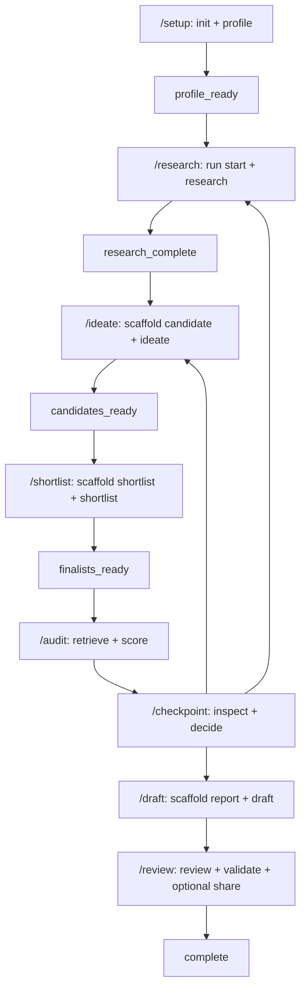

# Agent Commands and CLI Contracts

The eight Claude commands are thin orchestration surfaces, not a second workflow
engine: `/setup`, `/research`, `/ideate`, `/shortlist`, `/audit`, `/checkpoint`,
`/draft`, and `/review` elicit bounded inputs, invoke `python3 -m patent_factory`,
and relay the core's JSON result. The CLI owns validation, hashing, persistence,
state transitions, gates, artifact exports, and exit status. An agent must not
edit SQLite, artifact exports, state pointers, or manufacture IDs and hashes.

## End-to-end routing

This shows the normal path and the two explicit post-audit loops. The `audit score`
operation always creates the `post_audit_checkpoint` decision point, including a
clean audit; it is not safe for an agent to infer approval from a low score.

## Command-to-verb contract

| Slash command | Core entrypoints | Agent/user request input | Core-owned output and hand-off |
|---|---|---|---|
| `/setup` | `init`; `profile folder`, `profile document`, or `profile interview` | Source material under `documents/`, or interview responses | SQLite is authoritative; `profile.json` is a deterministic export. A conflict returns `conflict_resolution_required` and a core-issued `batch_id`; inspect/decide the exact batch rather than choosing silently. |
| `/research` | `run start`; `research fixture`, `research manual`, `research kipris`, or `research normalize-web` | Profile binding, bounded source/query, explicit HTTPS host allowlist for manual import, and (for live access) credential decision | Research artifacts, evidence IDs/hashes, adapter coverage/failures, and next state. Credential approval is a gate, not an agent authorization. |
| `/ideate` | `scaffold candidate`; `ideate` | Candidate prose and judgments in `candidate-input-v1`; references are copied from scaffolded upstream bindings | Validated candidate set and state. The core checks evidence and profile bindings; `domain_pivot_required` or `insufficient_evidence` stops the route. |
| `/shortlist` | `scaffold shortlist`; `shortlist` | Reviewed `shortlist-input-v1`: three axes, scores, rationales, confidence, supporting/contrary evidence, coverage, and gaps | Finalist set, with core-issued finalist IDs and state. Explicit insufficiency is a valid persisted outcome, not permission to invent finalists. |
| `/audit` | `scaffold audit-query`; `audit retrieve`; `audit score` | Hash-bound finalist query groups; agent-authored KO/EN terms; fixture manifest or explicitly selected live mode; reviewed feature-map set for scoring | Frozen corpora and `simrisk-v1.0.0` scoring. Retrieval can return `credential_required` (exit 5), and scoring can return `coverage_insufficient` (exit 7) or `decision_required` (exit 8). Always hand the latter to `/checkpoint`. |
| `/checkpoint` | `run status`; `gate inspect`; `scaffold gate-decision`; `gate decide` | Exact gate decision input: user-selected `approve`, `re_ideate`, `re_research`, or `stop`, reason, actor, all-finalist interesting/boring feedback, and a bounded plan only for `re_research` | Gate ID, subject hash, approval scope, decision ID, next state, and the fixed warning (when applicable). The core derives warnings; a submitted `warning` field is rejected. |
| `/draft` | `scaffold report`; `draft` | Drafter identity, date, questions, and language (`en` default or `ko`) in `report-input-v2` (legacy v1 means Korean) | Core-rendered eleven-section private report plus citation/decision bindings and report hash. It requires `audit_approved`; the wrapper never writes `draft.md`. |
| `/review` | `review`; `validate`; optional `share` | Independent reviewer input bound to the exact report hash; optional external-share input and core-issued disclosure decision | Review result, deterministic validation, and optionally guarded publication. `revision_required` returns to `/draft`; sensitive disclosure is a user gate, not an agent choice. |

The CLI parser also exposes inspection and maintenance verbs (`run status`, `run
show`, `gate inspect`, and `delete-run`), but they are supporting operations rather
than additional Claude slash commands. `run show` reads current artifacts, while
SQLite and the artifact registry remain authoritative.

## Request scaffolds: clerical bindings versus authored judgment

Scaffolds are deliberately drafts. They read current state and pre-fill IDs,
content hashes, span hashes, profile references, rubric versions, finalist-set
hashes, gate scope, and subject revision hashes from real revisions. Judgment and
creative prose receive `TODO(agent):` markers. Core submission still validates all
of this; filling a scaffold is not an approval and copying an export is not a
state transition.

The principal schemas are:

- `candidate-input-v1`: `/ideate` authors titles, technical problem, mechanism,
  components, effects, implementation, validation, questions, and synthesis
  narrative. Each candidate preserves epistemic labels; an `agent_inference` must
  carry a rationale and must not be phrased as fact.
- `shortlist-input-v1`: `/shortlist` authors scores and rationale for
  `differentiation`, `technical_feasibility`, and `utility_significance`, plus
  confidence, coverage, gaps, and contrary evidence. The candidate IDs and
  supporting bindings come from the candidate set.
- `audit-query-input-v1`: `/audit` authors one Korean and one English query per
  finalist. `finalist_set_hash` is core-bound. The feature-map input is likewise
  reviewed and sealed by re-deriving each `map_id`; scores and labels are never
  recomputed by the agent.
- `gate-decision-input-v2`: `/checkpoint` must contain exactly one top-level
  action. Every finalist needs `interesting` and `boring` feedback, including a
  clean approval. `plan` must be `{}` for every action other than `re_research`.
  On approval with breaches, `decisions` has exactly one
  `{action: retain_with_warning, finalist_id, reason}` per breaching finalist;
  the warning string is core-issued.
- `report-input-v2` and `review-input-v1`: report identity/language/questions and
  the independent review are authored inputs, but report hashes, citations,
  decision bindings, validation completion, and publication authorization are
  core outputs or checks.

For a fresh session after a checkpoint loop, a gate resolution may already be
stale because the first subsequent ideation or research publish invalidates its
DAG descendant. The durable export at
`<run>/decision-exports/ar_<revision_id>.json` retains the decision bytes; do not
edit them.

## Result envelope and error contract

Every normal invocation emits one compact JSON object on stdout. The CLI adds:

- `schema_version: "cli-result-v1"` and `envelope_version: "cli-envelope-v1"`;
- `command` (including nested names such as `audit.score`), optional `run_id`,
  `started_at`, and `ended_at`;
- `prior_state` and `next_state` (null when not supplied by the operation);
- `artifact_ids` and `event_ids` (with transition event IDs promoted into the
  latter); and
- `failure_code`, null on success. Adapter status is also surfaced as
  `adapter_summary` when present.

Operation-specific fields remain in the same object: for example `status`, gate
identifiers, coverage, adapter failures, artifact hashes, and report metadata.
Agents must quote `status` and `next_state` verbatim and treat the state as the
contract, not as prose inferred from an exit code.

Failures still emit the same envelope with `status: "error"`, a redacted `error`
message, and a classified `failure_code`. The classifier uses core exception
codes where present, then `invalid_json`, `invalid_unicode`, `cli_error`,
`io_error`, `invalid_input`, or `runtime_error`. Secrets matching credential
canaries are replaced with `[REDACTED]`. Argument/parser failures therefore stay
machine-readable. The `--help` and `--version` argparse actions are the deliberate
exception: they print plain text rather than a result envelope.

## Exit behavior and stop rules

Exit 0 means the operation completed its own permitted work, not necessarily that
the entire workflow is finished. The important non-zero statuses are:

| Exit | Meaning | Required handling |
|---:|---|---|
| 2 | CLI/input/runtime error envelope | Stop; correct the input or environment. |
| 3 | Profile conflict resolution required | Preserve `batch_id`; inspect and obtain the user's exact decision. |
| 4 | Research operation did not complete | Treat adapter failure or incomplete coverage as not-evidence; stop or follow the returned gate. |
| 5 | Credential gate (`credential_required`) | Preserve `gate_id` and `subject_revision_hash`; resume the exact request only with the core-issued `decision_id`. |
| 7 | Audit `coverage_insufficient` | Do not zero-fill or claim no reference; stop and use the returned coverage/evidence identifiers. |
| 8 | Audit `decision_required` | Expected for every `audit score`, clean or breaching; go to `/checkpoint`. |
| 9 | Sensitive disclosure gate | Preserve exact scope and gate ID; user chooses approve, redact, or stop. |
| 10 | Review `revision_required` | Do not validate; return to `/draft`. |
| 11 | Incomplete best-effort run deletion | Report failures; do not claim cleanup is complete. |
| 12 | Core-required domain-pivot gate | Preserve the gate and stop; never invent a decision. |

Some valid insufficiency paths use a non-zero exit while still emitting useful
JSON. Conversely, a zero exit from `gate inspect`, `run status`, or `scaffold`
only means that inspection/drafting succeeded. All `*_required`, `stopped`, and
`error` results are stopping signals unless the documented user decision and
exact core-issued identifier are supplied.

## Safety and ownership invariants

Inputs are contained under private `documents/` or `workspace/` roots, with byte
budgets and symlink/path checks at the CLI boundary. Live adapters require the
specific credential and host/scheme policy; a wrapper never authorizes hosted
external transfer. A source failure is an adapter event, not evidence.

The state machine permits only policy-defined transitions. Gates bind a decision
to a `gate_id`, `subject_revision_hash`, and approval scope, so reusing a decision
for changed input is rejected. Artifact revisions and exports are hash-bound and
can become stale when a descendant is published. The core, not the agent, owns
state pointers, artifact IDs, event IDs, finalist IDs, evidence IDs, report
hashes, scores, labels, warnings, and next states.

## Focused tests and safe extension

`tests/unit/test_g008_agent_surfaces.py` verifies that all eight command surfaces
exist, use the portable CLI, contain JSON contracts, avoid direct SQL/file-copy
operations, mention the required request versions, stop at core-owned gates, and
do not authorize hosted egress. `tests/unit/test_g008_cli_result_contract_docs.py`
checks that the shared envelope identifiers, plain-text help/version exception,
and exact safe cleanup/audit fixture boundaries are documented.

When adding a route, extend the parser and a core handler together, return the
same envelope through `main`, define explicit state/gate and exit semantics, and
add a scaffold only for clerical bindings. Keep human decisions in request files
and core-issued outcomes in artifacts/database exports; never make a wrapper infer
or persist policy.
