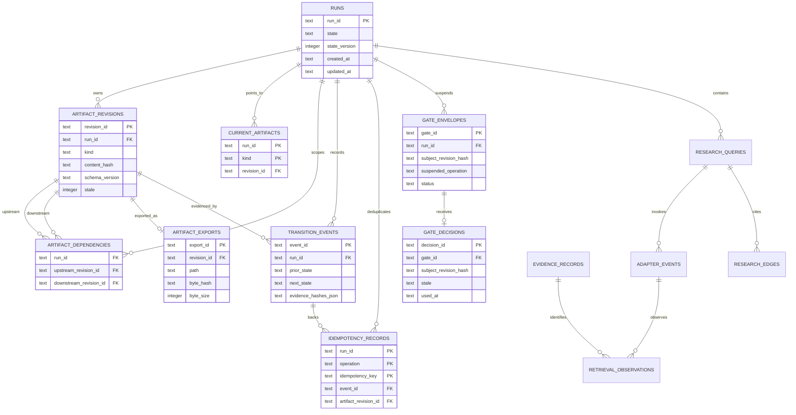
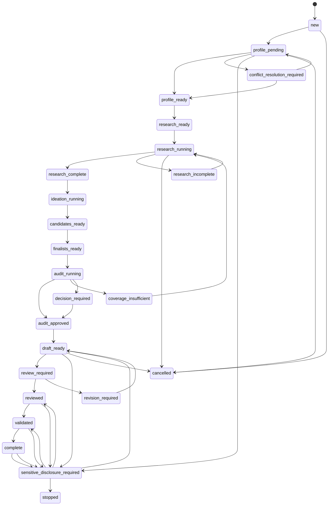

# State Kernel and Persistence

The state kernel is the boundary that makes a run reproducible rather than a collection of loose files. `connect_database` owns schema creation and migrations; `StateStore` owns run snapshots, legal transitions, artifact revision identity, dependency edges, gate coordination, and operation replay. The SQLite database is authoritative. Exported JSON or Markdown files are immutable projections whose existence alone does not make an artifact current.

## Durable model

The schema is versioned (`SCHEMA_VERSION = 7`) and enables foreign keys. Its original profile tables are retained alongside the run kernel: profile facts and claims establish an authoritative profile revision, while runs bind later work to that exact profile context. The run-side tables record the current state and its version, append-only transition events, immutable artifact revisions, current pointers, dependency edges, exports, idempotency records, and gate envelopes/decisions. Research persistence adds query envelopes, adapter events, evidence records, observations, edges, coverage limitations, and research-operation replay coordinates.

Caption: Durable run, artifact, gate, export, and research-record relationships represented by the SQLite schema.

An artifact revision is identified by its run, kind, canonical content, dependency IDs, and schema version. The resulting content hash therefore changes when either the payload, its contract, or its inputs change. A `(run_id, kind, content_hash)` uniqueness constraint makes identical active submissions converge on one immutable revision. `current_artifacts` is the small mutable index that says which revision of each kind is live; old revisions remain for provenance but may be marked `stale`.

## Run lifecycle and gates

`RunState` has an explicit transition table rather than permitting arbitrary status strings. The normal path begins at `new`, passes through profile readiness and research, ideation and audit, then draft, review, validation, and `complete`. `stopped` and `cancelled` are terminal for ordinary work. A mandatory gate is not merely a state label: entering it must publish a gate envelope through the gate API, and exiting it must consume a matching decision. Direct transitions into or out of gate states are rejected.

Caption: Policy-owned run lifecycle; gate states require envelopes and decisions, while `complete` requires the completion invariants described below.

`start_run` is the principal bootstrap entrypoint. It compares the supplied profile export byte-for-byte (after canonicalization) with `profile_payload` from the profile database, requires `profile_ready` with no conflicts, rejects credential canaries, then atomically records the profile-pending and profile-ready transitions and publishes a `profile_context` artifact while entering `research_ready`. `run_status` reports the state version and current artifact hashes; `run_show` returns one current artifact and rejects stale or unavailable pointers.

## Transactions and atomic publication

All state mutations use `immediate_transaction`, which acquires a SQLite writer transaction and rolls back on any exception. A busy writer becomes the bounded, retryable `RunBusyError` rather than leaking a database path or waiting indefinitely. Read snapshots use `consistent_snapshot`, so a caller sees one coherent state and pointer set.

`transition` performs the logical unit in one transaction: validate idempotency and gate approvals, validate the prior state, add an optional revision and dependency edges, append the transition event, claim a decision if applicable, update `runs.state` and `state_version`, and insert the idempotency record. Fault injection at revision, dependency, invalidation, pointer, event, state, or idempotency boundaries demonstrates that no partial authoritative unit remains.

`publish_transition` extends that transaction across the filesystem. It first writes the export with `export_immutable`, which uses a same-directory temporary file, flushes and fsyncs bytes, atomically creates the final path with no-clobber semantics, fsyncs the directory, and only then registers the export, activates the revision, records the event and state, and records idempotency. If a failure occurs after the file is published but before SQLite commits, the file can temporarily be an unregistered orphan; the next `StateStore` initialization calls recovery under the same writer lock. Recovery removes private `.artifact-*.tmp` files and unregistered `ar_*` exports, while refusing missing, altered, symlinked, or unsafe registered exports. Thus a failed database transaction leaves no authoritative pointer, and recovery reconciles filesystem residue without accepting silent corruption.

`publish_gate_transition` applies the same ordering to the more critical case of publishing an artifact and suspending the run at a gate. Artifact, export registry, current pointer, envelope, transition event, run state, and idempotency record commit together. Replaying the same operation/key returns the original artifact, export, and envelope; it does not publish changed caller payload.

## Invalidation, staleness, and idempotency

Replacing a current artifact invalidates its entire transitive downstream dependency closure using a recursive query. Descendants are marked stale and removed from current pointers; gate decisions and pending envelopes whose subject hash is affected are also marked stale or superseded. A stale revision cannot be used as a dependency, as a gate subject, or as a replay result. Consequently, changing a profile can remove current query and candidate artifacts even though their immutable rows remain available for audit history.

A previously invalidated immutable revision is not silently reactivated merely because the same payload is submitted. A still-live identical revision is reused, but a stale match raises `StaleRevisionError`; a new revision must be derived from a current dependency graph. This distinction prevents an old operation from reviving outputs computed from obsolete inputs.

Idempotency is scoped by `(run_id, operation, idempotency_key)`. A replay returns the recorded event, state, and artifact, and published replay additionally verifies that the artifact remains current and its registered export still exists. Concurrent callers serialize on the SQLite writer lock and immutable filesystem no-clobber operation: exactly one payload wins a fresh key, while a later same-key call replays it. If the winner has since been invalidated, replay fails closed with a stale-revision error instead of returning an obsolete result.

Gate approvals are more constrained than ordinary idempotency. A decision must match the gate's subject revision hash, approval-scope hash, suspended operation, and allowed authorizing action; the decision is atomically claimed once by the consuming transition. Any upstream mutation stales matching decisions and pending envelopes. A complete self-transition is treated as an external-share operation and requires an exact consumed approval.

## Completion and recovery invariants

Moving to `complete` is a semantic validation boundary, not a caller assertion. The kernel requires current `report`, `review`, and `validation` artifacts with their supported schema versions. It recomputes each content hash and dependency set, validates report and review semantics, recomputes the deterministic validation manifest, verifies that review is approved and bound to the current report, verifies validation hashes and `passed` status, checks required report/review/validation dependency edges, and checks every report binding still points to a current artifact or gate resolution. Any mismatch aborts the transaction.

Database migrations are also transactional. Each schema step runs under `BEGIN IMMEDIATE`, updates `user_version`, and commits only after all steps succeed; an injected migration failure rolls back both DDL and data changes. Versions newer than the supported schema are refused, and `PRAGMA quick_check` corruption is reported as `DatabaseCorruptError` without replacing the database. Operators should therefore retry a busy operation, rerun initialization to reconcile exports after a crash, and treat corruption or registered-export mismatch as an incident requiring recovery procedures rather than deleting SQLite or reconstructing pointers by hand.

## Focused verification

The kernel contract is exercised by the integration tests rather than by schema inspection alone:

- `test_g002_transactional_state_kernel.py` covers migration rollback and refusal of future versions, legal transition edges, mandatory-gate enforcement, immutable revision identity, transitive DAG invalidation, stale dependencies, idempotent replay, fault-boundary rollback, bounded busy-writer behavior, and exact gate approval consumption.
- `test_g002_publish_register_integration.py` covers export failure, every post-publish/database rollback boundary, concurrent same-key payloads, replay without republishing changed bytes, and rejection of replay after invalidation.
- `test_g002_snapshot_and_integrity.py` covers cleanup of interrupted temporary exports, refusal of missing or mismatched registered exports, and corruption refusal.
- `test_g002_invalidation_dag.py` focuses on dependency closure and stale propagation; `test_g002_publish_register_integration.py` and `test_g002_snapshot_and_integrity.py` jointly pin the database/filesystem recovery contract.

These tests are the safe-change checklist for adding a state, artifact kind, dependency edge, export format, gate action, or migration: update policy and invariants together, then test both successful replay and failure between each durable boundary.
