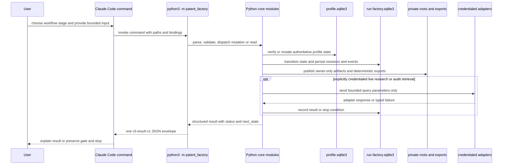

# System Overview and Ownership

AI Patent Factory is a local-first, gated workflow for turning private invention
material into evidence-bound reports. The driving Claude Code commands are a thin
orchestration surface: they tell the user where to put input, choose the next
operation, invoke `python3 -m patent_factory ...`, and report the CLI result. The
Python CLI and its imported core modules own validation, state transitions, gates,
invalidation, idempotency, hash binding, persistence, and exports. This boundary is
the central safety invariant: an agent must not edit SQLite, `profile.json`, or
immutable run exports to simulate a mutation.

## Runtime ownership boundary

The normal entrypoint is `python3 -m patent_factory`; `src/patent_factory/__main__.py`
exits with the return value of `cli.main()`. `cli.main()` parses the command, dispatches
to the appropriate core operation, wraps the result with the CLI envelope, emits one
JSON object, and maps guarded or failed outcomes to non-zero exit codes. The only
intentional plain-text probes are `--help` and `--version`.

*This sequence shows that Claude Code requests mutations but the Python core commits
state and controls any external boundary.*

## Components and authoritative boundaries

### Claude Code and other agent surfaces

`.claude/commands/` exposes the guided stages `/setup`, `/research`, `/ideate`,
`/shortlist`, `/audit`, `/checkpoint`, `/draft`, and `/review`. A command may prepare
or scaffold a user-authored JSON request and may interpret the returned status, but it
must delegate the actual operation. For example, `/research` first calls `run start`
and then calls an offline fixture/manual operation or an explicitly credentialed live
adapter. It must preserve `credential_required`, incomplete research, coverage, and
other gates rather than auto-proceeding. The raw CLI is also the supported escape
hatch for scripting and non-Claude surfaces such as Codex; it is not a second state
implementation.

Claude is not an authority for facts, approvals, or private persistence. It cannot
invent a `decision_id`, approval scope, gate reason, or evidence from an adapter
failure. Hosted-model context is an external processing boundary, so running a local
command does not authorize sending `documents/`, `workspace/`, profiles, or secrets to
Claude or any other service.

### CLI entrypoint and envelope

`cli.build_parser()` defines the public verbs and their arguments. The dispatch in
`cli.main()` routes profile work, `run`, `research`, ideation, shortlist, scaffolding,
audit, gate decisions, report/review/validation/share, and safe run deletion to core
functions. `_cli_result()` adds `schema_version: cli-result-v1`,
`envelope_version: cli-envelope-v1`, command and run identity, timestamps, state
fields, artifact/event identifiers, and a failure code. Exceptions become a
redacted JSON error (credential canaries are scrubbed) rather than an unstructured
traceback.

The CLI deliberately separates read surfaces from mutation surfaces. `run status`
reports the current run state and each current artifact's revision and content hash;
`run show` returns one current artifact body and hash. These make downstream input
construction possible without opening the run database directly. Missing artifacts and
unknown runs are actionable errors, not permission to inspect SQLite by hand.

### Core state and persistence

The profile database at `workspace/profile.sqlite3` is the authoritative profile
state. `workspace/profile.json` is a deterministic export and must never be edited
as a source of truth. Before a run starts, `prepare_run_profile()` reads the
authoritative database, rejects a mismatching supplied export, requires
`profile-v1` in `profile_ready` with no unresolved conflicts, and checks that
credential canaries are absent.

Each run has a private `factory.sqlite3` under its run directory. The state store owns
run snapshots, legal transitions, transition events, current artifact pointers, and
artifact revisions. Content is normalized and hashed; downstream artifacts bind to
upstream hashes or revisions, so changing an input invalidates the old approval rather
than silently reusing it. The run database retains artifacts that are needed for later
authoring, while selected artifacts are exported through core-controlled directories.

`run start` is the lifecycle bridge from profile to pipeline. It creates or reuses the
run, moves through `profile_pending` and `profile_ready`, publishes a hashed
`profile_context`, and enters `research_ready`. Its identity is derived from the run
and profile hash, making repeated execution replay-safe. `run status` and `run show`
are read-only views over current, non-stale revisions.

### Filesystem and network boundaries

`init` creates owner-only `documents/` and `workspace/` roots. Path helpers reject
absolute paths, `..` traversal, symbolic links, escapes outside the configured root,
and wrong file types; private directories are enforced as mode `0700` and private
files as owner read/write. Inputs are therefore relative, canonical, non-symlink
paths under `documents/` or `workspace/` as appropriate.

Most operations are offline. Public web metadata gathered by an agent is normalized
and then imported through the offline `research manual` path. The explicitly networked
paths are credential-gated `research kipris`, `audit retrieve --live`, and
`research serpapi`; they send bounded query/search parameters and credentials, not
private documents or profile data. Secrets are not persisted or logged and are
canary-scrubbed. Quota exhaustion and adapter failures are recorded as stops or
incomplete attempts, never converted into fabricated evidence.

## Lifecycle, gates, and failure semantics

The principal run states are `new`, profile binding (`profile_pending` then
`profile_ready`), `research_ready`, `research_running`, and `research_complete` or
`research_incomplete`; later stages progress through ideation, candidates,
finalists, audit, checkpoint, draft, review, validation, and completion. Terminal
states are `complete`, `stopped`, and `cancelled`. Gate states include unresolved
profile conflicts, credential approval, domain pivot, insufficient coverage,
post-audit decision, and sensitive disclosure.

A gate is a hard stop. The caller must retain its `gate_id`, exact subject revision
hash, actions, and `next_state`, then use `gate inspect` for the current gate. A
`gate-decision-input-v1` (or the post-audit `gate-decision-input-v2`) authored for the
exact subject and scope, plus the core-issued `decision_id`, is required for
`gate decide`. A stale decision cannot authorize changed content. The post-audit
checkpoint is always raised, even for a clean audit, and the user must choose
`approve`, `re_ideate`, `re_research`, or `stop`.

The drafter and reviewer are separate identities and passes: `draft` publishes the
private report, `review` records an independent review, and deterministic `validate`
may complete only from the reviewed state. `share` is a separate sensitive-disclosure
operation requiring an exact external-report request and current decision; copying a
report around the gate is not an alternative.

## Safe extension points and operational guidance

Add workflow behavior behind a core function and state-store operation first, then
expose it through `cli.build_parser()` and `main()`; keep command surfaces as
instructional adapters. New persisted material should use a versioned schema, a
canonical normalized representation, a content hash, an artifact revision, and an
explicit transition/event. New external adapters should use a bounded HTTPS query
envelope, typed failure outcomes, credential checks, budgets, and canary scrubbing;
they must not gain direct access to private source text.

When operating the system, start with `python3 -m patent_factory init` once, use the
slash commands or their documented CLI equivalents, and treat every non-success status
as meaningful. Inspect only the current gate when deciding how to resume. Delete a
private run only with `python3 -m patent_factory delete-run --run workspace/runs/RUN
--workspace-root workspace`; preserve partial-failure information from its JSON.
For release confidence, run the offline unittest suite, `compileall`, and the CLI
help probe.

## Focused verification

`tests/integration/test_run_inspection.py` verifies that `run status` exposes every
current artifact and its 64-character content hash, `run show` exposes retained
artifact bodies, hashes agree between both views, missing kinds list available kinds,
and unknown runs fail with `run_not_found`. These tests protect the agent-facing read
boundary that prevents direct database access.

`tests/unit/test_g008_run_start_surface_docs.py` checks that both Claude and Codex
document the same `python3 -m patent_factory run start` mapping, including run,
profile, database, and `research_ready` bindings, and that cleanup and CLI envelope
identifiers remain documented. Together these focused tests check both sides of the
ownership contract: the core is observable through safe JSON surfaces and agent
instructions delegate to the same CLI entrypoint.
