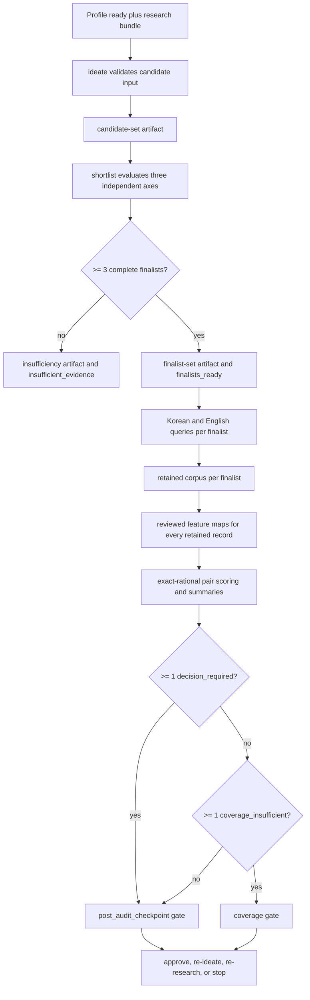

# Candidates, Shortlisting, Corpus, and Similarity Risk

This page describes the path from an evidence-bound proposal to a similarity audit. The system deliberately separates creative ideation, preliminary selection, retrieval, human feature mapping, and mechanical scoring. Similarity scores are **corpus-bounded research aids rather than legal conclusions**; an audit report must not be read as a novelty opinion.

## Control flow

This shows the enforced boundary from candidate publication through the audit gate. Retrieval and scoring do not bypass the gate, even when every finalist is individually labelled `audit_approved`.

## Evidence-bound ideation

`run_ideation` is a deterministic local validation and persistence boundary: it does not call a model, search the network, calculate simrisk, or decide excessive similarity. It first compares the supplied profile export with the authoritative profile SQLite payload, rejects credential canaries, requires a current `profile_ready` context without unresolved conflicts, and requires current research evidence revisions. It derives the candidate's stable `ca_` identifier from its normalized content, so changing upstream hashes or the body produces a new identity rather than silently mutating an old one.

A candidate is more than a title and a mechanism. Its closed structure includes the domain, technical problem, required inputs, components, interactions, transformations, outputs, expected effects, implementation example, measurable validation, unresolved dependencies and questions, profile references, research references, synthesis trace, and epistemic claims. At least one profile reference must be a problem and one a capability, and each reference is bound to field plus claim ID; this preserves distinct facts even where interview provenance shares a claim ID. The synthesis trace must name one of `modify`, `combine`, `adapt`, `constrain`, or `transfer` and point to candidate evidence.

Every candidate-level evidence reference must match the stored evidence content hash. A span hash must belong to that revision; when an exact span is unavailable, an explicit limitation is mandatory. Required fields carry claims, source facts and source inferences must point to a current `ev_` revision with matching content and span hashes, and at least one claim must be labelled `creative_suggestion`. These rules keep factual support separate from the proposal's creative contribution. Candidate exports are private, hash-addressed revisions published through the authoritative SQLite transaction and recovery path; changed upstream revisions stale dependent artifacts.

## Three-axis shortlisting

The shortlist input describes each proposed finalist once, with a positive integer priority and selection rationale. It must contain exactly three independent axes:

* **`differentiation`** — whether the proposal is distinguishable from the available evidence;
* **`technical_feasibility`** — whether the mechanism can plausibly be implemented; and
* **`utility_significance`** — whether the expected utility and effects matter.

Each axis is a 0–100 research-aid score, a preliminary (non-`simrisk`) rubric version, rationale, `low`/`medium`/`high` confidence, supporting and contrary evidence, gaps, and coverage assessment and limitations. Supporting evidence must be traced by the candidate, while contrary evidence and gaps cannot be used to conceal missing coverage. The runtime uses no numeric finalist threshold and never averages the axes: structural completeness is the eligibility condition. Duplicate candidates are rejected, then complete finalists are ordered deterministically by priority and candidate ID; rank and `fi_` identity are derived from the ordered, hash-bound body.

Three or more unique complete finalists publish immutable `finalist-set-v1` and transition to `finalists_ready`. Fewer than three publish immutable `insufficiency-v1`, with eligible and rejected IDs, reason codes, missing evidence, limitations, unresolved questions, and recommended research, and create no finalist pointer. This makes “not enough evidence” an explicit research result rather than an implicit empty selection.

## Finalist-specific retrieval and retained corpora

After `finalist-set-v1`, G005 requires one newly fingerprinted query group per current finalist. Each group contains both Korean (`ko`) and English (`en`) terms. The persisted query identity includes finalist-set hash, finalist ID, and query-group ID, but those binding values are not sent as KIPRIS request parameters. Retrieval uses the controlled KIPRIS adapter and paginated execution with a constant page window (`min(30, results_per_query)`), bounded by the configured page cap and result budget. Missing credentials suspend the operation behind a credential gate whose decision is scoped to the exact finalist set and query input.

`build_retained_corpus` admits only evidence reached through the exact G005 query IDs. It deduplicates by `(application identity, content revision)`, where identity is taken from application/publication/original/source identifiers after normalization. Records are ordered by query-hit count descending, best source rank ascending, application identity, then content hash. The limit is fixed at 100 for `simrisk-v1.0.0`; all substantive ties at the boundary are retained, while excluded records carry a `below_retention_boundary` reason. Query failures are retained in the corpus payload, and each corpus receives a content hash. The corpus set is a private, dependency-bound `corpus-set-v1` artifact, not a claim that the retrieved set is exhaustive prior art.

## Reviewed feature maps

A feature-map input must bind exactly to the current finalist-set and corpus-set hashes and to the current scorer configuration. There is one uniquely identified, frozen map per finalist. The canonical map contains candidate classifications, keyed features, reference maps, and a reviewed attestation. Feature categories are `problem`, `inputs`, `mechanism`, `transformations`, `outputs`, and `technical_effects`; their weights must total exactly the configured category weights (10%, 10%, 30%, 20%, 10%, 20%). Each feature has candidate span hashes, an essential flag, and a decimal weight.

Each retained reference is reviewed exactly once. Its map records inspected fields among title, abstract, and classifications, then one decision per feature: `matched`, `different`, `not_disclosed`, or `unavailable`, with a rationale. Positive or non-disclosure decisions require source spans; non-disclosure additionally requires inspected fields. Runtime validation checks that candidate spans belong to the finalist revision and reference spans belong to real retained evidence fields. Thus differentiation credit cannot be asserted without an essential-feature decision grounded in a span or an explicitly inspected non-disclosure field. The reviewer identity, timestamp, and `status: reviewed` form a frozen attestation.

## Pair scoring and routing

For each finalist, the scorer turns the candidate's problem/mechanism/input/component/interaction/transformation/output/effect material into title and abstract text and scores it against every retained reference. Text normalization uses NFKC, case folding, and the configured ASCII/Korean token pattern. Text overlap is the mean of token Jaccard and character-trigram Dice; title contributes 25% and abstract 75%.

Feature similarity is the weighted sum of matched feature weights. Coverage-aware values distinguish observed from high-bound possibilities: missing positive inputs are zero in `R_obs` but one in `R_hi`. Classification similarity uses the best pair of codes: subgroup 1.00, main group 0.80, subclass 0.55, section 0.25, and unrelated 0. The difference credit `D` is the proportion of essential feature weight marked `different` or `not_disclosed`. Aggregate scoring is exact rational arithmetic:

`R = 100 * clamp(0.25T + 0.60F + 0.15C - 0.20D, 0, 1)`

The scorer also emits `Q` coverage, matched and differentiated feature IDs, evidence ID, a label, and both observed and high-bound risk. All `T`, `F`, `C`, `D`, `Q`, `r_obs`, and `r_hi` values have numerator/denominator/value exact mirrors; validators reject inconsistent displays, out-of-range rationals, or a version mismatch. Labels are `low` below 35, `moderate` at 35, `high` at 55, and `excessive` at 75.

A finalist summary chooses the highest observed risk (ties resolved by upper risk and evidence ID) as the closest observed reference. It independently chooses the maximum upper bound, breaking equal upper bounds by lowest coverage and evidence ID. An empty corpus is `coverage_insufficient`; otherwise any observed risk at least 75 is `decision_required`, taking precedence over coverage. If no observed breach exists, upper-bound risk at least 75 or coverage below 80 produces `coverage_insufficient`; all remaining cases are `audit_approved`.

## Durable audit and gates

`run_audit_scoring` validates every current dependency before scoring: finalist, candidate, corpus, scorer configuration, feature-map identities, candidate spans, retained evidence fields, and one reviewed reference map for each retained record. It constructs `audit-batch-v1` with set hashes, scorer-config hash, per-finalist corpus hash, pair scores, summary IDs, coverage, and a mandatory counterargument stating that the result is only a provisional research aid. `validate_audit_artifact` recomputes labels and summaries from exact pair scores before publication, preventing hand-edited risk or routing fields.

The whole batch is published transactionally with its gate. Any `decision_required` result raises `post_audit_checkpoint` at `RunState.DECISION_REQUIRED`; otherwise any coverage insufficiency raises the coverage gate. Even an entirely clean batch raises `post_audit_checkpoint` and stops before `/draft`. Only `gate decide --action approve` resolves that checkpoint to `AUDIT_APPROVED`; `re_ideate`, `re_research`, and `stop` remain explicit alternatives. Completed scoring replays only when the supplied feature maps and all hash bindings match the current artifacts. This preserves immutable history while preventing stale approvals or changed requests from being reused.

## Configuration, extension, and tests

The canonical `simrisk-v1.0.0` configuration fixes corpus limit 100, result/page limits, tokenizer, category and aggregate weights, classification scores, thresholds, and version. Same-version parameter drift is rejected by configuration validation; changing canonical parameters requires a version bump. `calibration-trust-v1.0.0` currently has no approved manifest hash, so calibration approval is not silently inferred. Safe extensions should add a versioned configuration and corresponding schema/golden cases, preserve exact arithmetic and hash bindings, and keep adapters behind the retrieval boundary rather than embedding network behavior in ideation or scoring.

Focused tests that protect the contract include `test_g004_ideation_and_shortlist.py` for authoritative profile matching, evidence-bound candidates, deterministic shortlist ordering, insufficiency, stale dependencies, and transactional recovery; `test_g005_similarity.py` for normalization, exact duplicates, missing fields, coverage routing, threshold boundaries, rational consistency, legacy-map duplicate rejection, and frozen goldens; and `test_g005_audit.py` for query-group binding, pagination/corpus retention, feature-map validation, artifact cross-field validation, credential gates, checkpoint behavior, and replay. The schemas provide an additional closed-shape contract for candidate, finalist, feature-map, and audit artifacts.

### Related concepts

* [Provenance and artifacts](/openwiki/concepts/provenance-and-artifacts.md) — content hashes, revisions, and private exports.
* [Report, review, and validation](/openwiki/architecture/report-review-validation.md) — downstream report and gate validation.
* [Research and adapters](/openwiki/integrations/research-and-adapters.md) — retrieval boundaries and adapter capabilities.
* [Gated decisions](/openwiki/workflows/gated-decisions.md) — approval and resumption semantics.
