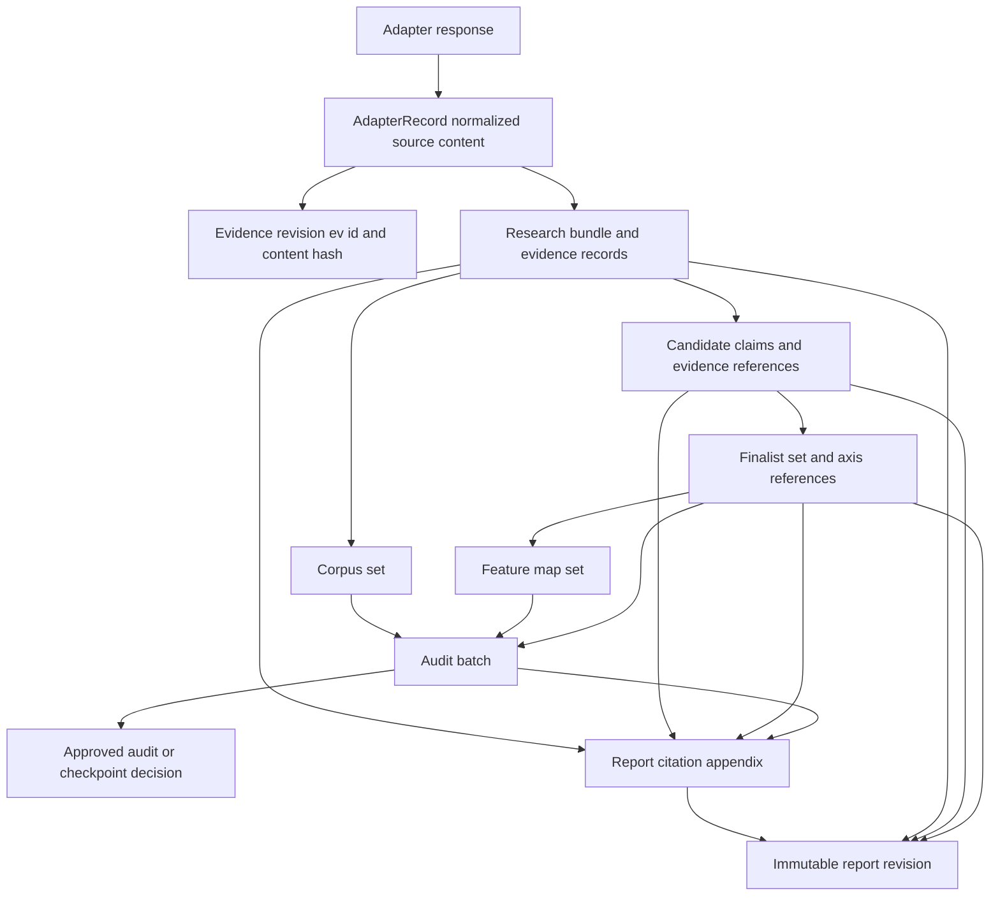

# Evidence, Hashes, and Artifact Lineage

This system treats research evidence, judgments, audits, reviews, and reports as a content-addressed lineage rather than as mutable blobs. A reader should be able to start at a report citation or audit result, resolve the evidence identifier and content hash, and then follow the hashes and dependency edges back through the candidate, finalist, corpus, research, profile, and scoring inputs that produced it.

The central distinction is epistemic as well as technical: a source fact is not the same thing as an interpretation, and a hypothesis must not be presented as a factual citation. The report renderer therefore preserves factual citation tokens while explicitly hedging candidate hypotheses, creative suggestions, profile-based inferences, and unresolved questions.

## Normalization and identity

`normalize` is the common canonicalization boundary. Strings are NFC-normalized, trimmed, and given normalized LF line endings; lists are normalized recursively; dictionary keys are stringified and sorted. `canonical_json` serializes that result as UTF-8 JSON without insignificant whitespace, and `digest` is SHA-256 over the canonical JSON. JSON ingestion uses `strict_json_loads`, which rejects duplicate keys after key normalization instead of silently allowing the last key to win.

There are two deliberate byte/hash surfaces:

* A logical object hash uses `digest(value)`, without a trailing newline.
* A JSON export uses `canonical_json_bytes(value)`, which appends one LF before hashing and writing the bytes.

Evidence identity is independent of retrieval time: `evidence_revision_id(source_locator, content_hash)` derives an `ev_` identifier from the normalized locator and content hash. Consequently, retrieving the same content again does not mint a new evidence revision merely because its observation date changed; changing the locator or content does. The content hash and source locator are therefore the stable identity inputs, while observation dates and mutable status metadata are reporting context.

## Evidence records and epistemic contracts

An adapter returns `AdapterRecord` values with source type, locator, original identifier, title, language, content hash, limitations, excerpts or field-span hashes, and optional source-reported legal-status metadata. The adapter result must include a response hash on success; a failure cannot contain evidence records. Evidence is persisted as an authoritative `evidence_records` row and is later projected into research and audit corpora.

`AdapterRecord.as_dict()` is an intentionally literal serialization boundary. Its fields feed the `record_json` stored by research and then the `corpus_set` hash. The adapter's normalized source record separately feeds `content_hash` and `evidence_id`. Legal-status fields are carried on the record and included in the corpus serialization when present, but excluded from the adapter normalized record: status can change (for example, from a registration token to another source token), and hashing it would change evidence identity, deduplication, idempotency, and replay behavior. Status tokens are reproduced verbatim in the report with an observation date; the system does not translate them into legal conclusions.

A candidate contains field-level claims, candidate-level evidence references, profile references, research and profile revision hashes, and a synthesis trace. Each field's `evidence_references` belongs to that field's claim, while the candidate-level reference list is the enclosing set. A reference carries an evidence ID, content hash, and either an exact span hash or an explicit limitation. This permits a report line to cite only the evidence bound to that field rather than accidentally attaching every candidate citation to every assertion.

The provenance claim contract distinguishes:

| Label | Meaning and binding rule |
| --- | --- |
| `source_fact` | Quoted source-backed fact; requires source ID, content hash, and span hash. |
| `user_statement` | User-provided statement; requires a source ID. |
| `source_inference` | Interpretation derived from a source; requires source bindings and rationale, and cannot be represented as a quote. |
| `agent_inference` | Agent interpretation; requires rationale and is an interpretation by default. |
| `hypothesis` | A hypothesis, not a source quotation. |
| `creative_suggestion` | A proposed idea, not a source quotation. |

Claim IDs include the resolved representation, so changing a source fact from quote to interpretation changes its identity. `SourceRepresentation.QUOTE` is rejected for inference, hypothesis, and creative-suggestion labels; this prevents an interpretation from masquerading as exact source text.

## Lineage from evidence to report

This diagram shows the report's evidence-to-lineage path; the report also binds profile context, scorer configuration, and any gate resolution as current artifact hashes.

## Artifact revisions and dependency invalidation

`ArtifactRevision` records a run-scoped revision ID, kind, content hash, structured content, schema version, creation time, and a `stale` flag. `StateStore` owns current-artifact pointers and the dependency graph. Publishing computes the artifact hash from `{content, dependencies, schema_version}` and derives a deterministic `ar_` revision ID from run, kind, content hash, and schema version. Dependencies must belong to the same run, must be non-stale, and must not create a cycle.

A new revision is published transactionally with its transition event, current pointer, dependency edges, export registry record, and idempotency record. The export path is a revision-specific `.json` or `.md` path. `export_immutable` rejects unsafe or symlinked targets, requires an existing directory, writes to a same-directory temporary file, fsyncs the file, publishes with a no-clobber hard link, fsyncs the directory, and refuses a conflict when an existing path contains different bytes. Repeating a publish for an identical path and payload returns a reused export; different bytes at the immutable path are an error.

Recovery runs under the SQLite writer lock. It removes only private `.artifact-*.tmp` residue, verifies registered exports by expected byte hash and size, rejects unsafe entries or paths outside configured directories, and removes unregistered published artifacts. This makes an interrupted export recoverable without silently accepting corruption or deleting another run's registered output.

When an upstream revision changes, `_invalidate_from` traverses all downstream dependency edges, marks descendants stale, removes their current pointers, and marks gate decisions for the affected subject hashes stale; pending envelopes for those subjects become superseded. A stale revision cannot be used as a new dependency or approval subject. Thus a changed research bundle can invalidate candidates, finalists, corpus, audit, review, and report rather than leaving a plausible but untraceable old report current.

## Audit and finalist bindings

A finalist stores the candidate revision hash and exactly three evaluation axes: differentiation, technical feasibility, and utility significance. Axes carry confidence, rationale, coverage assessment, limitations, gaps, rubric version, score, and supporting or contrary evidence references. Scores are author-supplied pass-through fields; the report says candidate order follows recorded selection priority, not an implicit score ranking.

An `audit-batch-v1` binds `finalist_set_hash`, `corpus_set_hash`, `feature_map_set_hash`, and `scorer_config_hash`. Each finalist result must identify the matching candidate, closest and upper-bound references, coverage, outcome, counterargument, and pair scores. Pair scores retain evidence IDs, matched and differentiated feature IDs, display percentages, exact numerator/denominator/value structures, and the `simrisk-v1.0.0` version. Cross-field consistency is checked before publication, hashing, or export. Audit outcomes are constrained to approved, coverage-insufficient, or decision-required; coverage failure blocks report generation until the required gate path is resolved.

## Report citations, revisions, and safeguards

`publish_report` reads only current, non-stale profile, research, candidate, finalist, corpus, feature-map, scorer, and audit artifacts. It requires at least three finalists, exact audit-to-current-input hashes, authoritative audit validation, one audit result per current finalist/candidate pair, and resolvable citation IDs. The report artifact binds those upstream hashes, the report policy hash, template hash, structured draft specification hash, drafter identity, language, and report date.

The report has exactly eleven ordered sections. Its citation appendix is a sorted unique projection of every citation token in the markdown. Each citation records `evidence_id`, content hash, identifier, title, source type, observation date, limitations, and optional URL. Validation requires the appendix IDs, citation IDs, and all markdown citation tokens to match exactly; an unresolved or extra token invalidates the artifact.

Citation rendering is field-aware. Factual lines can carry `[@ev_...]` tokens resolved through current evidence. Lines stamped `[candidate hypothesis]`, `[creative suggestion]`, `[profile-based inference]`, or `[hypothesis]` deliberately suppress citation tokens even if the underlying field has references: the label describes the rendered assertion as an interpretation or suggestion, not as evidence-backed source fact. This preserves the distinction between factual citations and hedged hypotheses rather than using a source citation to overstate a proposal.

Reports are revised, not overwritten. A revision must bind the current report hash and blocking review hash. A sensitive-disclosure redaction requires the exact current report-bound gate decision, records the prior report hash, field, reason, text hash, replacement marker, and decision ID, and publishes a new report revision while superseding the prior current report. Plaintext disclosure text is not copied into the redaction history. The report input boundary rejects credential canaries, and the renderer exposes only explicitly selected privacy-safe technical profile fields with their provenance claims.

At completion, the state kernel requires current report, review, and validation artifacts with supported schema versions. It recomputes their dependency-inclusive hashes, validates each artifact, reproduces deterministic validation checks, and verifies that review and validation bind the current report. A stale or mismatched report therefore cannot be promoted merely because its markdown still looks complete.

## Lifecycle and operational invariants

1. Normalize before hashing; do not use retrieval timestamps as evidence identity.
2. Keep source content identity separate from mutable metadata such as legal-status tokens.
3. Bind every downstream artifact to current same-run revisions, and reject stale, foreign, or cyclic dependencies.
4. Treat exports as immutable bytes and recover only private temporary residue or unregistered artifacts.
5. Resolve every citation to current evidence and keep appendix order identical to citation-token order.
6. Mark interpretations, hypotheses, and creative suggestions as such; never render them as quoted source facts.
7. Consume gate approvals once for the exact operation and subject revision; invalidation stales them rather than reviving them.
8. Preserve prior report revisions for auditability; create a new revision for redaction or correction.

## Focused tests that protect the contract

`test_provenance_contracts.py` exercises all six epistemic labels, required source/rationale fields, quote-versus-interpretation rejection, retrieval-date-independent evidence IDs, and claim identity changes when representation changes. `test_adapter_record_hash_boundary.py` freezes the `as_dict()` key set, confirms legal-status metadata reaches corpus serialization intentionally, confirms absent metadata does not churn unrelated serialization, and proves status changes do not change adapter content hashes or identity-preferred dedup fields. `test_us016_hedged_labels.py` protects the renderer lexicon and ensures hedged render sites do not acquire prior-art citation tokens. The artifact, state, report, audit, review, and validation test suites additionally exercise immutable export faults, recovery, dependency staleness, exact report bindings, citation closure, and completion invariants.

These tests are not merely schema checks: they guard the boundaries where a seemingly harmless field, label, timestamp, renderer change, or serialization refactor could break replay, deduplication, legal-language safety, or end-to-end traceability.
