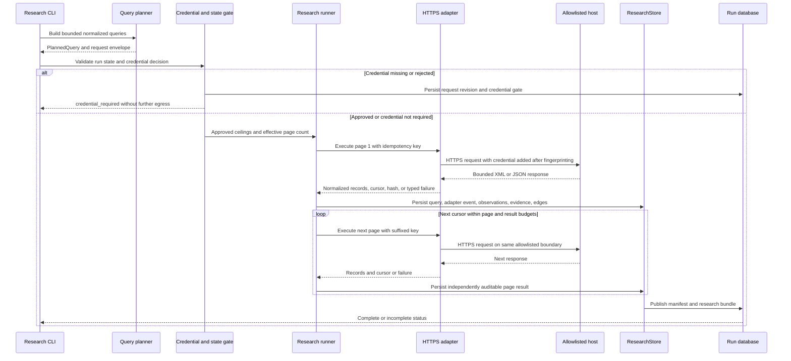

# Research Retrieval and External Adapters

Research is a bounded, auditable retrieval stage rather than an unrestricted web search. A planner creates normalized terms and immutable request envelopes; an adapter owns the vendor-specific wire contract; the research runner owns batching, credential gates, retry/idempotency policy, and pagination; `ResearchStore` owns durable observations, evidence revisions, edges, and failure limitations.

## End-to-end control flow

*The sequence shows the ownership boundary from planning through transport, pagination, persistence, and credential-gate handling.*

Every page is a separate persisted query and adapter event. A paged run stops at the first of its effective page limit, exhausted result budget, adapter failure, or missing cursor; a truncated run remains auditable rather than being silently discarded. Non-auth adapter failures become coverage limitations and the batch can continue to other planned terms, while an authentication failure suspends the exact batch behind a credential gate.

## Planning and budgets

`plan_keyword_queries` emits the origin query first, then normalized Korean and English synonyms, discovered terms, classifications, applicants, and inventors. Each group has a depth and is skipped beyond `max_depth`; case-folded duplicate terms are removed and planning stops at `max_calls`. Bibliography planning is deliberately separate because `bibliography_summary` has a different projection from `word_search`.

The envelope records the hashed request contract: adapter identity and version, capability, HTTPS scheme and allowed host, deadline, page 1, frozen `page_cap`, whole-query `result_budget`, per-response `byte_budget`, retry budget and `retry_ownership="research_runner"`. Validations constrain depth, calls, results, retries, page and byte budgets. The runner independently enforces `MAX_BATCH_REQUESTS=100` against actual planned queries multiplied by `effective_pages` before egress, protecting callers that construct queries without the planner.

Paging is opt-in through the unhashed `effective_pages` control (`1` by default and `5` for `--paging`); the hashed page-cap fossil remains `5` for replay compatibility. The pagination helper fixes the KIPRIS page window once at `min(30, ceiling)`, keeps `result_budget` at the whole-query ceiling, and uses the cursor as the next page number. It carries the byte budget unchanged per response. Thus page 2 cannot move its offset backwards by requesting fewer rows, and a misreporting source cannot loop forever because at least one result is charged when a cursor accompanies an empty page. Approved page and result ceilings are clamped again inside the pagination helper because pages after page 1 are created after credential approval.

Retry ownership is intentionally at the runner, not adapters. A failed fresh attempt advances its idempotency coordinate (`…-r2`, `…-r3`, and so on); explicit replay keys reproduce stored success or failure without network access. Page 1 preserves the caller key, while later pages use `:p02`, `:p03`, etc. Reusing a key for a different request fingerprint is rejected.

## HTTPS envelope and credential boundary

KIPRIS uses `https://plus.kipris.or.kr/kipo-api/kipi/patUtiModInfoSearchSevice`, with `getWordSearch` and `getBibliographySumryInfoSearch`. SerpAPI uses `https://serpapi.com/search` with `engine=google_patents`; its quota preflight uses `https://serpapi.com/account.json`. The adapters reject an envelope outside their exact HTTPS host allowlist, disable redirects, enforce deadlines and response byte limits, and classify HTTP authentication, rate-limit, timeout, network, oversize, malformed, unsupported, and internal failures.

`KIPRIS_PLUS_API_KEY` and `SERPAPI_API_KEY` are read only for the matching adapter. Credential parameters (`ServiceKey` or `api_key`) are added after request fingerprinting and are never returned in envelopes, events, manifests, logs, or exports. Stored response structures are checked against credential canaries. The recording transport also scrubs credentials, pins volatile bytes where configured, writes mode-600 fixtures, and returns the original response unchanged.

The credential gate persists the exact research request revision and approval scope. A missing credential, a rejected remote credential, or a forced second pass suspends before additional egress and requires a decision bound to that request. Resume validation checks the decision’s request revision, page ceiling, result ceiling, and idempotency coordinate. Stale, unbound, mismatched, or already-spent re-entry coordinates are refused before side effects; the supported replay of the decision that produced a published result remains network-free.

## KIPRIS adapter

The current KIPRIS contract is XML only. `word_search` permits `word`, `year`, `patent`, `utility`, and optional `num_of_rows`; `bibliography_summary` requires only `application_number`. KIPRIS pagination must contain explicit `totalCount`, `numOfRows`, and `pageNo`, with page and cursor agreement. A positive total without an item container, missing required identity fields, unsafe XML declarations, malformed XML, invalid pagination, and application responses without explicit success are malformed failures. HTTP 200 is not sufficient: `successYN=N` is inspected, with observed result code `30` treated as authentication failure and invalid-parameter responses treated as malformed.

Records normalize application numbers, dates, titles, applicants, abstracts, and IPC/CPC classifications. Multiple classification codes separated by `|` are split. A record’s identity is `kr-patent:<normalized-number>` and its content hash covers stable normalized metadata; mutable register status is carried as metadata but excluded from that hash. KIPRIS stores normalized public metadata plus a SHA-256 response hash, not raw payloads, and records the terms limitation that raw responses are not cached or redistributed. The legacy `openapi/rest` and `accessKey` contract is intentionally not mixed with `plus-xml-v1`.

## SerpAPI Google Patents adapter and quota fallback

The Google Patents adapter parses `organic_results[]`, requires `search_metadata.status` to be the final `Success`, and reads totals from `search_information.total_results` and the next cursor from `serpapi_pagination.next`. A top-level `error`, non-object response containers, invalid JSON, missing identity fields, or non-final status creates no evidence. HTTP 401/403 is auth, 429 is retryable rate limit, and timeout/network failures are normalized accordingly. Monthly-quota and throttle marker lists both map to rate limit but preserve distinct messages: monthly exhaustion can hand off to manual import, while transient throttling remains retryable. A supplied patent link is accepted only as canonical HTTPS `patents.google.com`; otherwise the URL is constructed from the validated publication number. Priority date is never substituted for missing filing date; the absence is recorded as a limitation.

Only `research serpapi` reaches SerpAPI. It checks the authoritative run state before egress, then performs a non-search account preflight. If remaining searches are at or below `--min-quota` (default 1), it spends no search: it writes a ready-to-fill `documents/requests/manual-web-template.json`, preserves an already edited template, records a `research_quota_stop` artifact revision, and returns `status: quota_exhausted` with exit code 12. Placeholder records, including the all-zero content hash sentinel, are rejected by manual import. A mid-search rate limit becomes quota exhaustion only when the account endpoint confirms it; otherwise it is an incomplete attempt, not fabricated quota state. Missing or rejected credentials produce `credential_required` with exit code 13. Fixture response and account paths must be supplied together and stay under the documents root, giving CI an all-or-nothing offline seam for preflight, gates, persistence, and fallback.

Google Patents evidence uses `gpatent:<normalized-publication-number>` and `source_type="google_patent"`, deliberately distinct from KIPRIS and manual URL locators. Identical titles, identifiers, or hashes therefore do not silently collapse across source families.

## Manual web normalization

Manual web retrieval is an offline import boundary: an agent or user supplies public metadata gathered out of band, and the trusted core validates and hashes it. `normalize_web_rows` accepts only known source tags (`arxiv`, `github`, `google_patents`, `naver`, `papers_with_code`, or `web`) and non-empty rows with URL, title, and identifier. URLs must be HTTPS on the configured allowlist and cannot contain credentials, fragments, or non-standard ports. Canonical URLs are re-serialized before persistence.

The closed manual schema rejects unknown fields, missing provenance or identity, non-SHA-256 hashes, template placeholders, and the all-zero placeholder hash. It normalizes title, abstract, excerpts, interpretations, limitations, and language; computes deterministic field-span hashes and a content hash; and round-trips through `sanitize_manual_records`. `ManualWebAdapter` then enforces JSON content type, byte and result budgets and emits `manual_web` records whose source locator is the canonical URL. Manual import never fabricates evidence from a quota skeleton: the user must edit it and run the offline import with the intended host allowlist.

## Persistence, provenance, and corpus boundary

`ResearchStore.execute` first prepares and validates an envelope, derives a query id from the run and request fingerprint, and checks the idempotency ledger before invoking transport. Successful records become evidence revisions keyed by source locator and content hash; each receives an observation and research edge with source rank. Empty successful responses still receive an observation. Failures receive an observation with `access_status="failure"` and a coverage limitation, but no evidence record. The transaction writes query, adapter event, observations, evidence, edges, limitations, and operation together, so injected faults roll back the partial attempt.

The research manifest scopes queries by `term_kind`, excluding audit queries even though audit retrieval shares the store and run id. Evidence is included through research edges, allowing a content-addressed record surfaced by both stages to remain correctly represented without leaking the audit stage into the research bundle. The resulting deterministic `research-bundle-v1` is published through the run state machinery.

Downstream retained-corpus construction is a separate concern. It groups hits by normalized patent identity and content hash, retains the best source rank while recording all logical query and page ids, applies the fixed retention limit of 100 with tie preservation, and records excluded records and retrieval failures. Adapter identity and source-locator families remain provenance boundaries; similarity or legal conclusions are not inferred by retrieval.

## Focused verification and operations

The most valuable tests exercise real contracts rather than mocked success paths:

- `tests/integration/test_research_pagination.py` drives the real `KiprisAdapter` with live-shaped XML and an offset-honoring transport, proving constant 30-row windows, no gaps or duplicate windows, cursor stopping, result-budget stopping, distinct page keys, and persisted page events.
- `tests/integration/test_audit_pagination.py` verifies the shared pagination primitive across the audit boundary.
- `tests/unit/test_g003_adapters.py` covers KIPRIS and SerpAPI envelopes, normalization, credential absence, malformed payloads, host and redirect boundaries, response-size limits, and typed failures.
- `tests/integration/test_g003_research_persistence.py` covers gates, idempotent replay, durable observations, bundle publication, failure limitations, and state behavior.
- `tests/unit/test_recording_transport.py` proves byte-level capture, canary scrubbing, volatile-field pinning, permissions, and non-perturbing return behavior.

Ordinary CI is offline. Live smoke checks are optional and credential-gated; they spend real vendor quota and must not weaken fixture-contract tests. Vendor terms, quotas, rate-limit headers, and response drift beyond committed fixtures remain external operational facts. Drift is surfaced as a malformed failure rather than guessed into the evidence graph.
