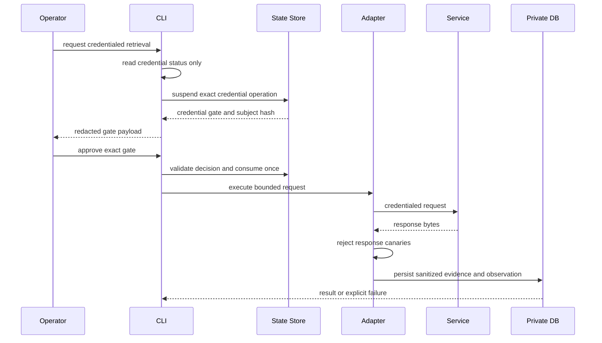
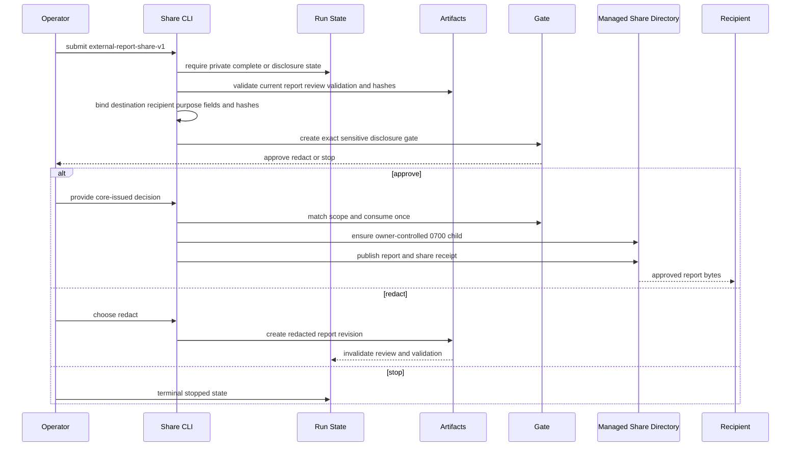

# Privacy, Credentials, and External Sharing

The factory is local-first, but “local CLI” is not permission to put private text into a hosted model or send it to another party. The Python core is the authority for paths, state, gates, artifacts, and exports; the driving agent may assemble requests, but it must not infer approval or bypass the core. Outputs are invention-organizing support material, **not legal advice**: the system does not decide patentability, novelty, inventive step, validity, or non-infringement/FTO.

## Private roots and filesystem controls

`python3 -m patent_factory init` creates `documents/` and `workspace/` as owner-only roots. `documents/` contains inventor input and local research imports; `workspace/` contains profile state, per-run `factory.sqlite3`, and generated exports. Except for the tracked README stubs, both roots are git-ignored. Keep source, profiles, raw research, reports, and requests inside these roots.

The path policy is defensive rather than merely conventional:

- Private directories are verified and enforced as mode `0700`; private regular files are owner read/write (`0600`). Existing roots are hardened when used.
- Absolute paths and `..` traversal are rejected. Existing path components are checked for symbolic links, and expected file kinds are enforced before reading or writing.
- A run directory must be a non-root directory contained by the configured workspace. `delete-run` removes only that contained run, does not follow links or touch siblings, and returns a report including partial failures.
- Outputs require an existing, safe parent and cannot escape the configured root. External share destinations are required to be outside the owner-only run and are separately validated.

This makes permissions and containment part of the runtime invariant, not something operators must remember to repair manually. Input documents are UTF-8 `.md`, `.txt`, or `.json`; unsupported formats are not parsed, and the documented ingestion limit is under 2,000,000 bytes. Never place credentials in documents or request files; keep them in the environment.

## Data classes and retention

The privacy model labels data explicitly:

| Data class | Meaning | Default retention |
| --- | --- | --- |
| `restricted` | Secrets and raw/private source that must remain in the environment or private run | `environment_or_private_run_only` |
| `confidential` | Private run material, such as report content before approval | `run_lifetime` |
| `internal_public_derived` | Derived material based on public input, retained by content-hash revision | `content_hash_revision` |
| `internal_redacted` | Redacted internal material | `30_days` |
| `public_redacted` | Deliberately redacted material approved for repository-level use | `repository_lifetime` |

These are defaults, not a promise that deletion is automatic. Operators should delete a run when its private material is no longer needed and treat retention changes as a deliberate data-governance decision. Immutable revisions, hashes, and dependency bindings mean that changing an upstream artifact makes dependent review, validation, or approval stale rather than silently updating it.

## Secret handling and canary scrubbing

`environment_secret` accepts only an ASCII uppercase, digit, and underscore environment-variable name and returns the value only to the code path that needs it. Diagnostic helpers expose presence and mode (`environment`, `simulated`, or `fixture`), never the secret. Known credentials currently include `KIPRIS_PLUS_API_KEY` and `SERPAPI_API_KEY`; `credential_canaries` collects present values so every boundary can test all known credentials, rather than only the adapter in the current command.

Use `redact_mapping` for diagnostic structures. Keys containing markers such as `api_key`, `authorization`, `password`, `secret`, `token`, `private`, `proprietary`, `raw_document`, or `source_span` have their values replaced with `[REDACTED]`, including nested mappings. `assert_canaries_absent` recursively scans strings in mappings and sequences and raises a boundary-specific error without echoing the canary.

At the transport boundary, `recording_transport` scrubs canaries from response bytes before writing a fixture, applies configured volatile-field pins, writes beneath a `0700` parent, and sets the recording to `0600`. It then verifies that no credential survived. This is the correct boundary because the raw response exists there; adapters parse and return derived results later. Live adapters also reject credential canaries in responses before research persistence. A canary failure is a hard privacy failure, not a warning or a reason to continue with partially persisted evidence.

## Credentialed retrieval gate

Fixture and other offline paths do not need credentials. Credentialed KIPRIS retrieval uses `KIPRIS_PLUS_API_KEY`; the CLI constructs the adapter with credential enforcement and passes an optional core-issued `decision_id`. If the credential is missing or the request needs approval, the research transaction suspends at a `credential` gate and the CLI returns a redacted gate payload. Approval is valid only for the exact current request binding, including its subject and operation; a stale or mismatched decision must be resolved again. The same gate discipline applies when a live second research pass is re-entered from a prior decision: it needs a bounded approved plan and a current binding.

_Caption: Credentialed retrieval remains suspended until the exact request is approved; response canaries are checked before persistence._

Failures are explicit: no credential does not become fabricated evidence, and an upstream failure is recorded as a failure/limitation rather than converted into a successful result. Operators should use fixture mode for offline diagnostics and tests, and should not copy a secret into logs, JSON, prompts, or fixtures.

## Sensitive disclosure and guarded sharing

Creating a private report, reviewing it, and reaching private `complete` are distinct from external disclosure. `share_report` is the only report egress boundary. It accepts exactly `external-report-share-v1`, requires a non-empty destination, purpose, recipient, current report hash, and sorted unique `sensitive_fields`, and requires that the listed fields exactly match the current report’s sensitive disclosures. The report, review, and validation artifacts must all be current and mutually valid.

The first share attempt creates or reuses a `sensitive_disclosure` gate whose subject is the current report hash and whose approval scope contains the effective destination, recipient, purpose, report/review/validation hashes, report content hash, and sensitive-field hashes. No decision means no export. The human may approve this exact disclosure, choose `redact`, or `stop`:

- **Approve** consumes one decision and publishes the report plus a `share_receipt` under the destination’s owner-controlled `.patent-factory-shares` child, which is forced to `0700` and must be owned by the current user. Caller files in the destination are not managed or deleted.
- **Redact** creates a new report revision without the sensitive text, invalidates dependent review and validation, and returns the run to drafting/review rather than sharing the old revision.
- **Stop** is terminal and publishes neither a share receipt nor an external report.

A changed recipient, purpose, destination, sensitive-field list, report hash, or any bound artifact hash cannot reuse the prior approval. Exact repeated requests are idempotent replays: they return the existing share result without consuming the decision again or mutating state. Unsafe destination ancestors or managed children fail before approval consumption.

_Caption: External sharing is a separate exact-scope gate; approval, redaction, and stopping have different state and publication outcomes._

The egress scope is deliberately hash-scoped. The lower-level `guarded_hosted_call` refuses a missing or stale `EgressApproval`, compares subject revision hash, recipient, model class, purpose, and approval scope, requires a non-empty approved data-class set, canonicalizes content hashes, and checks that requested classes are a subset of the approval. It checks canaries before invoking the callback, so a blocked payload never reaches the hosted call. The resulting `EgressManifest` records the decision, recipient, model class, purpose, scope, approved data classes, subject hash, and content hashes; its deterministic manifest identifier is derived from that body.

This is also the extension boundary for future hosted integrations: add a minimized payload projection and an approval/manifest integration, not a direct network call from a workflow. Running a local command, using Claude Code, or using another agent does not itself satisfy this approval. Hosted processing must be treated as external unless a separately verified local model is configured.

## Operational checklist and tests

Before a sensitive or credentialed run:

1. Confirm `documents/` and `workspace/` are the intended owner-only roots and that paths are relative, contained, and not symlinked.
2. Keep secrets in the environment; inspect only redacted credential status. Use fixture mode when network access is unnecessary.
3. Inspect current artifact hashes and gate scope. Do not hand-invent `decision_id`, `gate_id`, report hashes, or recipient/purpose bindings.
4. For sharing, verify the exact recipient, destination, purpose, sensitive-field list, and current report hash. Treat a changed value as a new disclosure request.
5. After a run, use the supported `delete-run` command and inspect its deletion report; do not recursively remove a workspace root by hand.

Focused coverage includes `tests/unit/test_privacy.py` (retention coverage, redacted diagnostics, approval matching, canary blocking, redaction, safe deletion, and root hardening) and `tests/unit/test_credential_canaries.py` (all known credentials, absent/empty values). Integration coverage in `tests/integration/test_g007_report_review_validation.py` exercises exact one-use share approval, changed-scope rejection, redaction invalidation, stop behavior, replay without mutation, symlinked destinations, managed-directory ownership/safety, caller-file preservation, and distinct approvals for distinct shares. Retrieval and credential-gate behavior is covered by the research integration and CLI tests, including offline diagnostics, transactional suspension, exact retry, response-canary rejection, and no-fabrication failure behavior.

For adjacent lifecycle and authority details, see [Report, review, and validation](/openwiki/architecture/report-review-validation.md), [Research and adapters](/openwiki/integrations/research-and-adapters.md), [Recovery and run maintenance](/openwiki/operations/recovery-and-run-maintenance.md), and [Gated decisions](/openwiki/workflows/gated-decisions.md).
