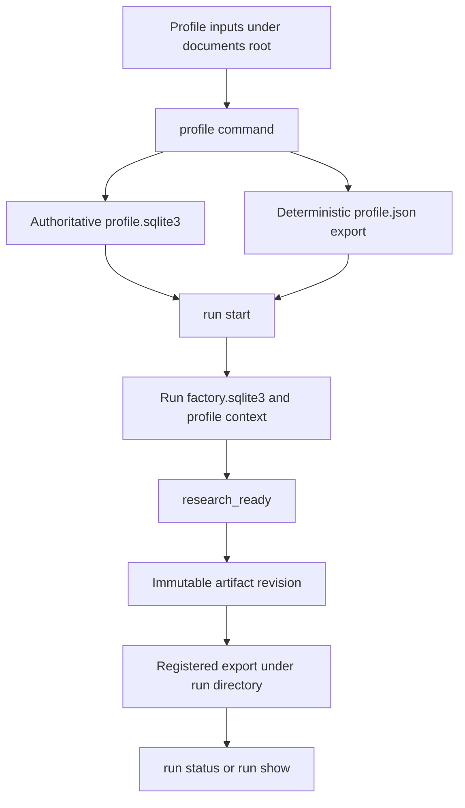
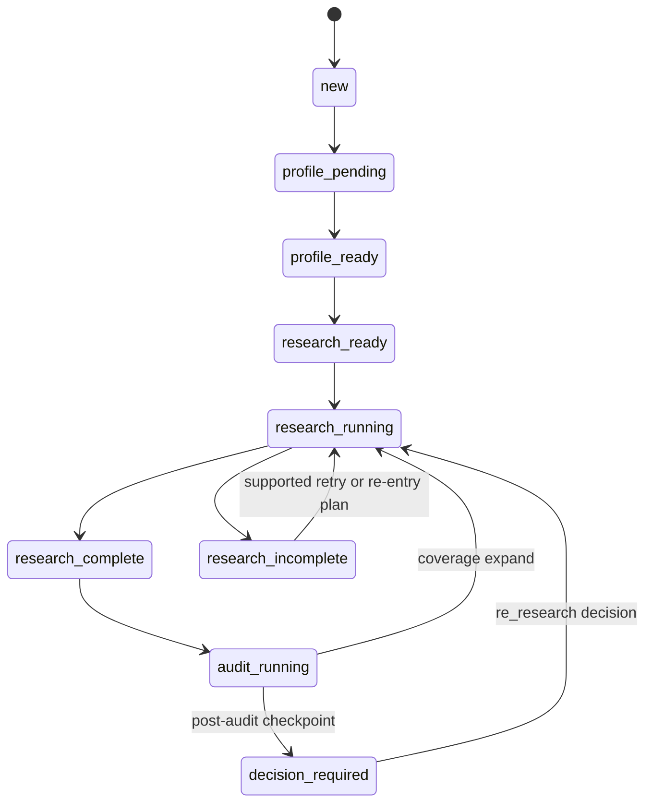
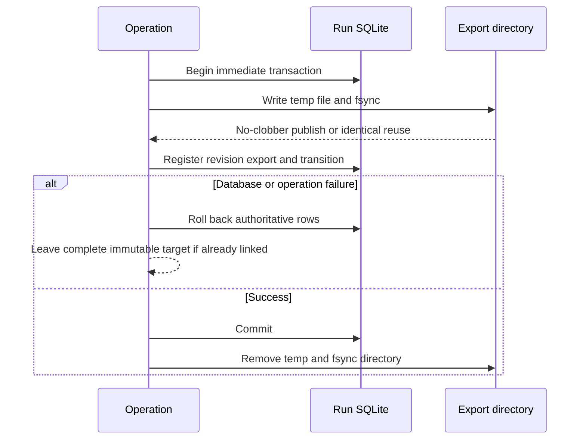

# Configuration, Run Operations, and Recovery

This system treats the profile database and run database as authoritative state; JSON and Markdown files are registered exports or inputs, not alternate databases. Use the CLI and the supported library boundaries below. **Do not hand-edit SQLite, profile exports, or generated artifacts.** If a file is missing or inconsistent, recover through the owning operation rather than repairing bytes manually.

## Operating model

A profile is ingested from documents or interview responses, committed to `workspace/profile.sqlite3`, and exported as deterministic `workspace/profile.json`. A run then binds an exact, current `profile_ready` profile to its own `factory.sqlite3`, records the profile context, and enters `research_ready`. Run artifacts are immutable revisions: downstream stages bind to content hashes, while `current_artifacts` identifies the usable revision. Replacing an upstream artifact therefore makes dependent work stale rather than silently changing it.



*The supported path from private inputs to an inspectable, hash-bound run.*

### Configuration versions and hashes

`config/defaults.json` is the evaluation configuration and must have exactly the documented fields: `factory-defaults-v1`, `candidate-v1`, `finalist-v1`, exactly three finalists, and the three named rubric versions. `load_evaluation_config()` rejects unknown or missing fields and unsupported versions. The similarity configuration is equally strict: only `simrisk-v1.0.0` and its canonical weights, tokenizer, thresholds, and fixed budgets are accepted. Any semantic change requires a versioned configuration change, not an in-place edit that leaves old artifacts ambiguous.

Both configuration objects normalize their canonical representation and expose a SHA-256-derived `content_hash`. Stages store that hash in their artifacts and validate it against current upstream artifacts. When changing configuration for a future run, preserve the old version and let the new run bind the new hash; do not rewrite a configuration referenced by an existing run.

## Credentials and private roots

- Keep `KIPRIS_PLUS_API_KEY` (and any other service credential) in the process environment only. Never put it in a profile, document, request, log, artifact, or exported JSON. Credential checks are local and report `missing`, `present`, `simulated_invalid`, or `fixture_usable`.
- Initialize private roots with `python3 -m patent_factory init`. The default roots are `documents/` for private inputs and `workspace/` for generated state and exports; custom roots may be supplied to `init`.
- Inputs and `--responses` files must be below the documents root. Databases, exports, and versioned request files must be below the workspace root. Paths must be relative, cannot contain `..`, and existing path components cannot be symlinks. Private directories are enforced as `0700`; private files as owner read/write (`0600`). Regular-file and size checks happen before ingestion (documents and response files are capped at 2,000,000 bytes).
- Live research is bounded by its command’s budgets and credential gate. A missing or rejected live credential suspends the exact operation before adapter egress; inspect and decide the gate, then resume the same command with `--decision-id`. Do not “test” a key by copying it into a file.

## Start and inspect a run

First create or update the profile through one supported input path, then start a run with both the export and authoritative database. `run start` verifies that the supplied profile JSON is byte-for-byte canonical-equivalent to the authoritative database, has `profile_version: profile-v1`, is `profile_ready`, has no conflicts, and contains facts. It records a versioned `profile-context-v1` artifact containing the profile revision and hash.

```bash
python3 -m patent_factory init
python3 -m patent_factory profile folder documents
python3 -m patent_factory run start \
  --run workspace/runs/example --run-id example \
  --profile workspace/profile.json --profile-database workspace/profile.sqlite3
```

If profile ingestion returns exit code `3` (`conflict_resolution_required`), inspect and decide the batch; the transaction has applied no canonical or compatible facts:

```bash
python3 -m patent_factory profile conflict-inspect --batch-id BATCH_ID
python3 -m patent_factory profile conflict-decide --batch-id BATCH_ID --input DECISION_JSON
```

Use inspection commands instead of opening the run database:

```bash
python3 -m patent_factory run status \
  --run workspace/runs/example --run-id example
python3 -m patent_factory run show \
  --run workspace/runs/example --run-id example --kind corpus_set
```

`run status` reports the run state, state version, and every current artifact’s kind, revision ID, schema version, creation time, and content hash. `run show` returns one current artifact body plus its hash and revision ID; `corpus_set` is intentionally persisted for inspection even though it is not exported. A missing kind is an actionable error listing available kinds; an unknown run is `run_not_found`.

## Lifecycle and safe reruns

The state machine is deliberately conservative: research normally proceeds `research_ready → research_running → research_complete | research_incomplete`, with one research operation per run after completion. A second pass is not a general retry escape hatch. It is allowed only through the audit coverage expansion route or the post-audit checkpoint’s bounded `re_research` route. Live second-pass attempts force a fresh credential gate scoped to the recorded plan hash and literal search terms, including retries; approval is consumed by the exact operation and must be supplied via `--decision-id`.



*The relevant run states; re-entry to research is corrective and plan-bound, not arbitrary.*

For an ordinary incomplete attempt, rerun the same command. The executor advances to a fresh attempt key (`-r2`, `-r3`, and so on) rather than reusing the coordinate that already published. For a live re-entry, resolve the newly raised credential gate and resume with its decision ID. If a pinned coordinate was already used, expect `live_research_reentry_spent_coordinate_issue_48`; do not calculate around it or reuse another pass’s approval.

Read CLI JSON even when the exit code is non-zero. Exit `2` means invalid or unsafe input and nothing was written; `4` is an incomplete but recoverable stage; `5` is a credential or evidence gate; `7` is coverage insufficiency; `8` is the post-audit decision checkpoint; `9` is sensitive disclosure; `10` requires revision. Gate workflows are always `gate inspect` → author the decision → `gate decide` → resume the original operation with the decision ID.

## Atomic persistence and registered exports

Profile JSON uses a same-directory temporary file, writes UTF-8 deterministic JSON, flushes and `fsync`s the file, sets owner-only permissions, and atomically replaces the destination. Database migrations and state mutations use `BEGIN IMMEDIATE` and roll back on any exception; busy/locked writers return the retryable `run_busy` error. Database startup enables foreign keys, applies migrations transactionally, runs SQLite `quick_check`, and rejects unsupported schema versions or corruption.

Artifact publication is a separate but coordinated invariant. `export_immutable()` rejects unsafe targets, detects conflicting existing bytes, writes a same-directory `.artifact-*.tmp`, fsyncs the file, uses no-clobber linking, fsyncs the directory, and removes only its private temporary file. `StateStore.publish_transition()` registers the artifact’s semantic hash and export byte hash together with dependencies, current pointer, transition event, and idempotency record. If a post-export database step fails, the database rolls back but the complete immutable export may remain; this is intentional and safe to reconcile later. A repeated same-key operation reuses the same artifact and export, while a different payload cannot overwrite an immutable path.



*Publication keeps authoritative registration transactional while treating a completed immutable file as recoverable residue after a fault.*

## Artifact recovery

Recovery is supported only through `recover_artifact_exports(directory, registered=...)` or its owning operation; it is not a license to edit or delete generated files by hand. The directory must be a real directory, not a symlink. Recovery removes regular `.artifact-*.tmp` files in deterministic name order. When a registered export map is supplied, every registered path must be directly in that directory and match its expected SHA-256 byte hash and size; a missing or mismatched registered export fails recovery. Published `ar_*` files must be `.json` or `.md`; unregistered published artifacts are removed, and directory metadata is fsynced after removals.

If recovery reports a registered export missing or mismatched, stop and investigate the authoritative registry and filesystem through the owning workflow. Do not recreate bytes from memory or alter `artifact_exports`. A successful idempotent rerun can reuse a matching export; a changed payload is an `artifact_conflict` and must be treated as a real integrity failure.

## Delete a run safely

Delete exactly one contained run with the top-level command:

```bash
python3 -m patent_factory delete-run \
  --run workspace/runs/example --workspace-root workspace
```

The command rejects a missing or unsafe workspace, the workspace root itself, a run outside the workspace, a symlink in the run path, or a non-directory run. It recursively removes only that run, uses `lstat` and `unlink`/`rmdir` so symlinks are never followed, sorts entries deterministically, and cannot touch siblings. The JSON result contains `root`, `removed`, `failures`, and `status`. `status: deleted` exits `0`; filesystem errors are reported as `status: partial_failure` and exit `11`. Preserve that report and retry the supported command after correcting the filesystem; never use recursive deletion against `workspace/` or hand-delete its SQLite, exports, or logs.

## Recovery checklist

1. Preserve the complete sorted JSON envelope and its `status`, `next_state`, `failure_code`, or gate fields; a non-zero code can be a safe stop.
2. Run `run status` and, where needed, `run show --kind KIND` to identify current state and hashes.
3. For profile conflicts or gates, inspect the exact batch/gate and make the explicit decision; never bypass a gate.
4. For `run_busy`, retry after the other writer has finished. For incomplete research, rerun the command; for re-entry, use only the recorded bounded plan and fresh decision ID.
5. For filesystem or artifact problems, use the owning atomic writer or registered artifact recovery routine. Do not edit SQLite, profile JSON, or generated artifacts.
6. When private material is no longer needed, use `delete-run` and retain its deletion report, especially after a partial failure.

## Focused verification

The operational contracts are exercised by:

- `tests/integration/test_run_inspection.py`: status exposes every current artifact hash; show exposes bodies; hashes agree; missing and unknown runs produce actionable errors.
- `tests/integration/test_g002_publish_register_integration.py`: migration rollback, pre-export and post-publish fault behavior, atomic semantic/byte-hash registration, idempotent replay, gate enforcement, and concurrent same-key publication.
- `tests/integration/test_reentry_byte_identity.py`: first-pass credential isolation, second-pass forced gating, salted retry coordinates, and decision-bound resume identity.
- `tests/integration/test_g002_snapshot_and_integrity.py` and `tests/integration/test_reentry_byte_identity.py`: deterministic snapshots and byte-identity invariants for reruns and re-entry.
- `tests/integration/test_run_inspection.py` plus the privacy tests: supported CLI inspection and contained deletion behavior; symlink and sibling protections must remain intact.
