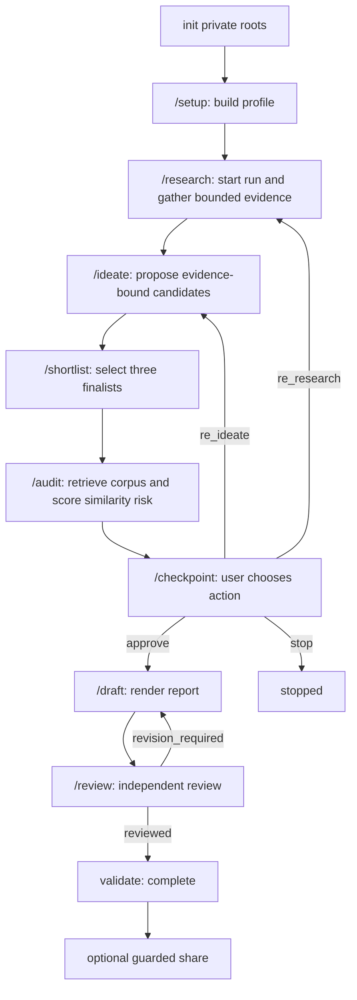

# Quickstart

This is the shortest supported route from private invention material to a reviewed,
evidence-bound report. The system is local-first: the Python CLI owns state, gates,
hash bindings, transitions, and exports; Claude Code slash commands are the guided
interface. Local execution does **not** authorize sending private text to a hosted model
or another recipient.

## 1. Initialize safely

Prerequisites are CPython 3.11+, a terminal, and no third-party runtime packages. From
the repository root, verify the CLI and initialize once:

```bash
python3 -m patent_factory --version
python3 -m patent_factory init
```

`init` creates owner-only `documents/` and `workspace/` (or alternate roots supplied by
`init --documents DIR --workspace DIR`) and nothing else. Put UTF-8 `.md`, `.txt`, or
`.json` material under `documents/`; PDF, DOCX, and image files must first be converted.
Paths must remain beneath the documents root, with no absolute paths, `..`, symlinks,
non-regular files, or documents over 2,000,000 bytes. Never put
`KIPRIS_PLUS_API_KEY` in a document; keep credentials in the environment.

- `documents/` is private user input: notes, references, interview responses, research
  fixtures, manual results, and the audit fixture manifest.
- `workspace/` is generated state and authored request inputs. `profile.sqlite3` is the
  authoritative profile database and `profile.json` is its deterministic export.
  Per-run authoritative state lives under `workspace/runs/<RUN>/factory.sqlite3`, with
  immutable research and other artifact exports alongside it.

Do not hand-edit SQLite, JSON exports, state pointers, or decision exports. Add or revise
inputs through the commands; the core validates request schemas and binds IDs and hashes
to prior revisions. For the deeper ownership model, see [System Overview and Ownership](/openwiki/architecture/system-overview.md), [Agent Commands and CLI Contracts](/openwiki/architecture/agent-and-cli-surfaces.md), and [State Kernel and Persistence](/openwiki/architecture/state-and-persistence.md).

## 2. Recommended slash-command route

Use the slash commands in order. At each step, report the CLI JSON `status` and
`next_state` rather than inferring success from prose or exit code.



This shows the normal control flow and the two deliberate post-audit re-entry paths.

### Profile: `/setup`

Place the user's material in `documents/`, then ask them to choose exactly one input
path: a folder, one document, or an interactive/scripted interview. The command runs
one of:

```bash
python3 -m patent_factory profile folder documents
python3 -m patent_factory profile document documents/background.md
python3 -m patent_factory profile interview --responses documents/interview.json
```

The profile is merged idempotently, so adding material and rerunning is safe. If a batch
conflicts with existing facts, the whole batch is held at
`conflict_resolution_required`; preserve its `batch_id`, inspect it, and wait for the
user's versioned decision. Do not choose a value or bypass the conflict.

### Evidence and run: `/research`

`/research` starts a fresh run and binds the authoritative profile into
`research_ready`, then performs one bounded operation: offline `fixture`, imported
`manual` results, or live credentialed `kipris`. Web research is performed out of band
and imported offline through `research normalize-web` followed by `research manual`.
A live KIPRIS attempt requires `KIPRIS_PLUS_API_KEY`; a missing or rejected credential
opens `credential_required` before egress. Preserve `gate_id` and resume the same
command only after the user decides with the core-issued `decision_id`.

A research source failure is an adapter event, not evidence. `research_incomplete` can
mean the adapter succeeded but added no new records because all results deduplicated;
read `incomplete_reason` before deciding whether to add an unseen reference. Research
publishes a deterministic bundle manifest under the run's owner-only
`research-exports/`. A completed run cannot be researched again by a general direct
call; only audit coverage expansion or the checkpoint's bounded `re_research` branch
can re-enter research.

### Candidates, finalists, and audit: `/ideate` → `/shortlist` → `/audit`

Use `scaffold candidate` and `scaffold shortlist` to prefill bindings, then author the
judgment and inventive fields. Candidates must be evidence-bound (and distinguish facts
from inference); a shortlist must contain three finalists, each scored independently on
`differentiation`, `technical_feasibility`, and `utility_significance`. If three
 defensible finalists cannot be supported, preserve `insufficient_evidence` rather than
manufacturing them.

`/audit` retrieves a finalist-specific KIPRIS corpus from a reviewed query input and
fixture manifest, or through the explicitly approved live path, then scores with the
fixed `simrisk-v1.0.0` scorer. Do not recompute scores, labels, corpus, or feature maps.
A thin corpus raises `coverage_insufficient`; inspect and resolve its gate before
continuing. For the complete evidence and similarity model, see [Candidates, Shortlisting, Corpus, and Similarity Risk](/openwiki/concepts/candidate-and-similarity-audit.md), [Evidence, Hashes, and Artifact Lineage](/openwiki/concepts/provenance-and-artifacts.md), and [Research Retrieval and External Adapters](/openwiki/integrations/research-and-adapters.md).

## 3. The mandatory human checkpoint

Every `audit score` ends at `decision_required`, even when coverage is complete and the
risk is clean. It is a normal hard stop, not a failure and not permission to draft.
`/checkpoint` reads the pending gate and CLI exports, composes one dossier per finalist,
and elicits exactly one user action:

- `approve` → `audit_approved` → `/draft`;
- `re_ideate` → `ideation_running` → `/ideate`, using the user's per-finalist feedback;
- `re_research` → `research_running` → `/research`, using a bounded plan;
- `stop` → `stopped`.

The user must provide `interesting`/`boring` feedback for all three finalists on every
action. `re_research` additionally requires `plan.needed_research`. Scaffold with
`gate-decision-input-v2`; all `TODO(agent)` markers, the action, reason, actor, and
feedback must be resolved before `gate decide`. On approving breaches, the user supplies
one `retain_with_warning` reason per breaching finalist; the warning itself is
core-derived. Never auto-approve, invent feedback, or fabricate `gate_id` or
`decision_id`. Gate mechanics and re-entry semantics are detailed in [Gates, Human Decisions, and Re-entry](/openwiki/workflows/gated-decisions.md).

## 4. Draft, independently review, and release

Only an `audit_approved` run may draft. Scaffold a hash-bound `report-input-v2.json`,
choose English (`"language": "en"`, the default) or Korean, and run `/draft`. The core
renders the eleven sections and bindings; the wrapper does not edit the report.
`/review` must use a reviewer identity and pass different from the drafter and the exact
report hash. If review returns `revision_required`, return to `/draft`; do not validate.
Only `validate` returning `complete` finishes the workflow. External `share` is always
a separate operation: a sensitive scope raises `sensitive_disclosure_required`, which
must be decided by the user (`approve`, `redact`, or `stop`) before resuming with the
same input and `--decision-id`. See [Report Rendering, Review, and Release Validation](/openwiki/architecture/report-review-validation.md) and [Privacy, Credentials, and External Sharing](/openwiki/operations/privacy-and-egress.md).

## 5. Inspect state and use the raw CLI when needed

The slash commands are the recommended surface. For a fresh session or debugging,
inspect the run and its exact pending gate from CLI-owned state:

```bash
python3 -m patent_factory run status --run RUN --run-id RUN_ID
python3 -m patent_factory run show --run RUN --run-id RUN_ID --kind candidate_set
python3 -m patent_factory run show --run RUN --run-id RUN_ID --kind finalist_set
python3 -m patent_factory gate inspect --run RUN --run-id RUN_ID --gate-id GATE_ID
```

`SETUP.md` is the raw CLI escape hatch for scripting and non-slash runtimes. Every
command emits one sorted JSON `cli-result-v1` / `cli-envelope-v1` object; safe stops may
use non-zero exits, so read `status`, `next_state`, and failure details. Common meanings
are: `2` invalid input/path (fix and rerun), `3` profile conflict, `4` incomplete
recoverable stage, `5` credential or shortlist evidence gate, `7` coverage gate, `8`
post-audit decision, `9` sensitive disclosure, and `10` review revision. A hard stop is
not an invitation to copy an export or edit the database: preserve `gate_id`,
`subject_revision_hash`, `actions`, and `next_state`, obtain the user's exact decision,
then resume with the same input and core-issued `decision_id`.

For operational cleanup, deterministic exports, recovery, and safe run deletion, see [Configuration, Run Operations, and Recovery](/openwiki/operations/recovery-and-run-maintenance.md). For the complete journey and re-entry narrative, see [End-to-End Invention Workflow](/openwiki/workflows/end-to-end-pipeline.md); for behavioral contracts and the offline golden journey, see [Testing Strategy and Behavioral Contracts](/openwiki/testing/contracts-and-golden-journeys.md).

## Scope reminder

The output is invention-organizing support material, not legal advice. Similarity results
are research aids within the retrieved corpus and do not conclude patentability,
novelty, inventive step, validity, or non-infringement/FTO.
