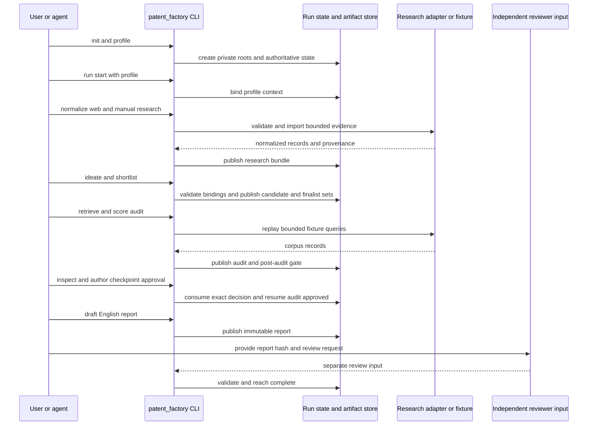

# Testing Strategy and Behavioral Contracts

Testing is organized around **behavioral boundaries**, not test directories. The system is a local-first, gated pipeline: the Python CLI owns state, artifacts, hashes, exports, and gate decisions, while the driving agent supplies structured inputs and (for web evidence) imports externally gathered metadata. Tests therefore protect both the positive journey and the refusal behavior at each boundary.

The most important rule is that a passing test must exercise the authority it claims to verify. Adapter fixture tests replay recorded bytes through the real adapter; report validation reconstructs expected bytes from current artifacts; privacy tests prove callbacks are not reached; and the full journey starts from `init` instead of synthesizing upstream database state.

## Coverage map

| Behavioral boundary | Contract under test | Focused coverage |
| --- | --- | --- |
| Private roots and CLI result surface | Inputs and generated state stay in owner-controlled roots; results have a stable `cli-result-v1` shape and safe failure status | `tests/unit/test_privacy.py`, `tests/integration/test_cli_profile_paths.py`, `tests/e2e/test_release_evidence.py` |
| Profile and run binding | A run starts only with an authoritative profile/export pair and binds the profile into run-scoped immutable state | `tests/e2e/test_full_journey.py`, `tests/integration/test_g003_research_persistence.py` |
| Research adapters | Query envelopes constrain host, scheme, budgets, pagination, and capability; responses normalize into the closed record shape | `tests/unit/test_g003_adapters.py`, `tests/unit/test_google_patents_adapter.py`, `tests/unit/test_kipris_live_shape.py` |
| Fixture provenance | Every fixture is registered and hash-pinned; declared edge shapes are demonstrated by parsed bytes, not manifest labels | `tests/unit/test_fixture_provenance.py`, `tests/fixtures/PROVENANCE.json` |
| Candidate and finalist persistence | Schema-complete evidence-bound candidates and three complete finalists are required; insufficiency creates an explicit artifact and no finalist pointer | `tests/unit/test_g004_contracts.py`, `tests/integration/test_g004_ideation_and_shortlist.py`, `tests/integration/test_scaffold_feature_map.py` |
| Audit and frozen scoring | Corpus selection, feature-map bindings, exact SimRisk arithmetic, and per-finalist outcomes are reproducible and scoped to the current finalist set | `tests/integration/test_g005_audit.py`, `tests/integration/test_g005_atomic_gate.py`, `tests/unit/test_g005_similarity.py` |
| Gates and invalidation | A decision matches one current gate subject, exact scope, and suspended operation; branch targets belong to the state kernel; upstream changes stale descendants | `tests/integration/test_g002_gate_matrix.py`, `tests/integration/test_g002_invalidation_dag.py`, `tests/integration/test_research_reentry_gate.py` |
| Report/review/validation | The renderer is deterministic; review is a separate hash-bound pass; only current approved review plus passing validation completes a run | `tests/integration/test_g007_report_review_validation.py`, `tests/unit/test_report_evidence_map.py`, `tests/e2e/test_full_journey.py` |
| Release evidence | Required test execution, calibration status, privacy scan, manifests, and atomic output rules determine release eligibility without leaking canaries | `tests/e2e/test_release_evidence.py` |

## Runtime boundary: from private input to complete report

The committed full journey is the primary behavioral integration test. It uses temporary private document and workspace roots, the committed Justin example, recorded web rows, and a KIPRIS XML fixture. It walks the public CLI entrypoints rather than calling internal stage functions: `init`, profile creation, `run start`, research normalization/manual import, scaffold-and-fill for ideation and shortlist, audit retrieval and scoring, gate inspection/decision, English drafting, independent review, and validation.

*This sequence shows the authoritative CLI/state boundary and the user-authored checkpoint between scoring and drafting.*

The test deliberately asserts lifecycle results at each transition: `research_ready`, `research_complete`, `candidates_ready`, `finalists_ready`, `audit_running`, `decision_required`, `audit_approved`, `draft_ready`, `reviewed`, and finally `complete`. `audit score` must return exit code 8 and raise `post_audit_checkpoint` even when every finalist is individually `audit_approved`; there is no score-to-draft shortcut. The checkpoint decision includes feedback for every finalist, and approval is authored in the scaffolded `gate-decision-input-v2` rather than inferred by the test harness.

## Frozen schemas, identity, and byte identity

Structured request formats are contracts, not loose fixtures. Unit contract tests cover documented schemas and required fields, while integration tests verify that the core adds authoritative hashes and IDs rather than trusting caller-supplied identity. Ideation requires profile and current research references, exact spans when available (or an explicit limitation), and a synthesis trace. Shortlist scoring has three independent 0–100 research-aid axes with rubrics, rationale, confidence, contrary evidence, gaps, and coverage limitations; there is no numeric threshold or averaging rule. Three or more unique complete finalists publish `finalist-set-v1`; fewer publish `insufficiency-v1` and no finalist pointer.

The golden assertion is stronger than checking headings or a few phrases. After the full journey renders the English report, the test compares its UTF-8 Markdown bytes exactly with `examples/justin/expected-report-en.md`. `JUSTIN_GOLDEN_REGENERATE=1` is an explicit maintainer operation for an intentional renderer change, not a normal test escape hatch. This catches changed ordering, whitespace, citations, section content, and serialization choices that semantic assertions could miss.

Report tests protect a second byte-identity boundary: validation reconstructs report sections and Markdown from the current profile, research, candidate, finalist, scorer, corpus, feature map, audit, and hash-bound draft specification. Extra, omitted, altered, reordered, or contradictory material fails even when citations look valid. A report revision invalidates its review and validation; a review cannot edit the report it covers.

## Gates, invalidation, and re-entry

Gate tests exercise the state kernel as the sole owner of resumption. Every decision is bound to the pending gate, current subject revision hash, exact approval scope, and recorded suspended operation. Callers select an action but never a resume state. `stop` is terminal; approval is consumable once and only by its recorded operation. Coverage actions such as `expand` and `retry` resume the appropriate research or audit branch, but the stored plan is intent and does not fabricate missing artifacts.

The post-audit checkpoint supports `approve`, `re_ideate`, `re_research`, and `stop`. Approval requires exactly one core-derived retain-with-warning decision for each `decision_required` finalist, all current finalist bindings, and mandatory interesting/boring feedback. Any coverage-insufficient finalist prevents approval until re-ideation or re-research resolves the gap. Re-entry tests prove that a bounded research plan is hash-bound, that a second research pass republishes the bundle, and that old evidence-dependent candidate, finalist, corpus, feature-map, audit, decision, draft, review, and validation pointers become stale. Attempts to skip ahead are rejected.

The invalidation DAG is tested independently of any one workflow: changes to profile, evidence, finalists, corpus, feature maps, or scorer version stale all dependent decision, draft, review, and validation revisions and remove their current pointers. This is the regression test to run when adding an artifact dependency or changing lifecycle transitions.

## Adapter contracts and recorded fixtures

Adapter tests cover the transport and normalization boundary rather than merely testing URL construction. KIPRIS tests prove:

- missing credentials and rejected targets make zero network calls;
- HTTPS/host restrictions, no-follow redirects, final-target checks, timeout, byte-budget, rate-limit, unsupported-capability, authentication, and malformed XML failures normalize to explicit failure kinds;
- successful XML is normalized and paginated without persisting the API key;
- empty success preserves rate-limit metadata;
- application-number bibliography retrieval and alternate date formats canonicalize to the same date form;
- entity-bearing XML and incomplete counts produce no records.

Manual web import is an intentionally different boundary: it makes no network call and requires HTTPS, an allowlisted host, JSON, SHA-256 content identity, and explicit provenance/limitations. Google Patents and KIPRIS live-shape tests extend the same closed-record contract across adapter capabilities.

`tests/fixtures/PROVENANCE.json` is a fixture registry. Completeness prevents an unregistered oracle from appearing silently; pinned SHA-256 bytes detect drift; required edge shapes prevent happy-path-only coverage. The important control is replay: each declared shape is checked on the real parsed adapter result (or raw bytes where canonicalization hides the original date format), never accepted because the manifest says so. A deliberate re-record must update the hash and explain its reason.

## Privacy and security assertions

Privacy is tested as a non-egress invariant, not as documentation. Secret-status and credential-diagnostic APIs return presence/status only and never the value. Hosted callbacks are blocked without a current exact approval, with a subject-hash mismatch, or with a stale decision; rejected calls leave the callback untouched. Canary detection blocks the callback and redacts the canary from the error. Mapping redaction removes secret and proprietary fields while preserving public fields.

Filesystem tests verify owner-only private roots, safe deletion inside the workspace, rejection of an outside path or symlink root, and no traversal through a symlink to a sibling/outside directory. Release-evidence tests add subprocess and tracked-file leak checks: failures must not echo canaries, and release manifests report privacy failure without exposing the secret.

Sharing is separately gated from private drafting and normal completion. Its approval binds exact report content, recipient, destination, purpose, sensitive fields, and subject hash, and is consumed once. Redaction creates a new report revision and invalidates review/validation. An exact retry replays the immutable receipt/export without consuming another approval; changed scope requires a new gate.

## Release evidence and test operations

`tests/e2e/test_release_evidence.py` treats release verification as an evidence-producing boundary. It checks deterministic validation replay, calibration trust states, required-test discovery/execution, explicit skip behavior, privacy status, schema/version inclusion, atomic and owner-only manifest writes, and failure exit codes. Calibration can be `deferred_provisional` or `qualified_independent`, but release remains `review_blocked` until the recorded trust requirements are met; a trusted manifest can make it `eligible`. Required tests cannot be silently omitted, and an explicit skip is visible in the manifest.

When changing a contract, use the narrowest boundary suite first, then the affected integration tests, and finish with the golden journey and release-evidence path. Do not “fix” a failing golden by regenerating it unless the renderer change is intentional and reviewed. For adapter changes, add or update a recorded fixture and provenance note, replay it through the real adapter, and retain structural edge-shape assertions. For privacy or release changes, include a canary assertion and verify that both stdout/stderr and generated manifests remain non-sensitive.
