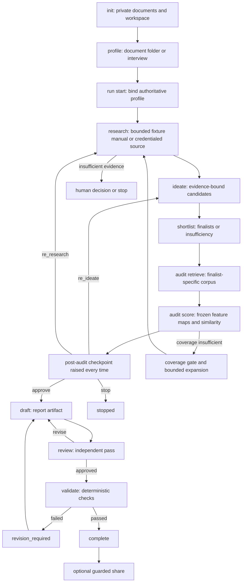

# End-to-End Invention Workflow

This is a local-first, gated journey: the CLI owns state transitions, artifact
hashes, exports, and decisions; an agent or inventor authors the stage inputs.
The representative Justin journey exercises the real CLI from `init` to
`complete`, while keeping the actual source material private. The workflow
organizes invention evidence and does not decide patentability, novelty,
inventive step, validity, or FTO.

## Pipeline at a glance

*The flow shows that audit scoring raises the post-audit checkpoint before any drafting; even a clean audit cannot bypass that decision.*

## 1. Initialize private roots

`python3 -m patent_factory init` creates owner-only `documents/` for supplied
notes and references and `workspace/` for the authoritative profile database,
profile export, requests, run databases, and generated artifacts. It does not
create a run or infer facts. Inputs and outputs must remain inside these roots;
path checks reject unsafe symbolic-link or out-of-root paths.

The recommended command surface is the slash-command sequence `/setup`,
`/research`, `/ideate`, `/shortlist`, `/audit`, `/checkpoint`, `/draft`, and
`/review`; raw `python3 -m patent_factory ...` verbs are the escape hatch.

## 2. Build and bind the profile

Profile input may be a folder, one `.md`, `.txt`, or `.json` document, or an
interview. Documents become `IncomingFact` values with source claims and
content/span hashes. Merging is conservative: conflicting values leave the
profile unchanged and require conflict resolution; a successful merge is
exported deterministically as `profile.json` and stored authoritatively in
`profile.sqlite3`. Re-running can add claims without duplicating the same claim.

`run start` is the binding boundary. It compares the supplied profile export
byte-for-byte (canonical JSON) with the authoritative database, requires
`profile-v1`, `profile_ready`, no unresolved conflicts, and a profile revision,
then publishes a `profile_context` artifact containing the profile, revision id,
and profile hash. The run advances through `profile_pending` and
`profile_ready` to `research_ready`. A changed profile therefore cannot be
silently substituted into an existing run.

## 3. Gather bounded evidence

Research plans a bounded `QueryEnvelope` and executes it through an adapter.
The offline paths are fixture data or agent-gathered web metadata normalized
with `research normalize-web` and imported with `research manual`; live KIPRIS
requires `KIPRIS_PLUS_API_KEY` and an explicit credential gate. Each operation
records query, execution, evidence records, edges, failures, and retrieval time
in the run database, then publishes a `research_bundle` and reaches
`research_complete` when successful evidence exists, otherwise
`research_incomplete`.

Credential absence or an authentication failure suspends the exact request
behind a credential gate. The gate binds the operation, subject revision, and
approval scope; a second credentialed pass is salted into a new attempt
namespace, rather than replaying a spent coordinate. Non-auth source failures
remain recorded as coverage limitations rather than being silently discarded.

## 4. Ideate and shortlist

`scaffold candidate` emits a hash-bound `candidate-input-v1` template. The
agent fills it with one or more candidates whose claims reference profile facts
and research evidence. `run_ideation` verifies that the submitted profile is the
authoritative one, checks evidence and profile/research revision hashes, rejects
duplicated ids, and publishes an immutable `candidate_set` after an
`ideation_context`. A candidate that changes the profile domain pauses at a
`domain_pivot` gate; it cannot smuggle a new domain through ordinary ideation.

`scaffold shortlist` then produces `shortlist-input-v1`. Shortlisting must
account for every candidate exactly once: selected finalists are scored on the
configured independent axes and every non-selected candidate needs an explicit
exclusion. If enough finalists exist, the run publishes `finalist_set` and
reaches `finalists_ready`; otherwise it publishes an explicit `insufficiency`
artifact and stops at `insufficient_evidence`.

## 5. Retrieve and score the audit

Audit retrieval derives finalist-specific query groups from the frozen finalist
set, records the scorer configuration, and retains bounded corpora in a
`corpus_set`. The retrieval loop uses a constant page window and records source
failures. A changed finalist set or scorer configuration creates a new query
revision; a completed corpus is replayed only when it is bound to the exact
current query revision.

The agent supplies one frozen feature map per finalist. Scoring validates that
candidate spans belong to the finalist, every retained corpus record is
reviewed exactly once, and reference spans belong to real evidence fields. It
publishes `feature_map_set` and `audit_batch`, with per-finalist pair scores,
coverage, observed and upper-bound risk values, outcomes, and corpus bindings.

There are two important stops:

- If no finalist has enough inspectable coverage, the run reaches
  `coverage_insufficient`; the user may expand research, retry the audit, or
  stop.
- Otherwise—and crucially even when every finalist is clean—the run reaches
  `decision_required` with a `post_audit_checkpoint` gate. The scope contains
  every finalist's dossier, not merely breaching ones. `audit score` therefore
  exits with a decision-required result rather than drafting automatically.

## 6. Resolve the post-audit checkpoint

Inspect the gate, scaffold `gate-decision-input-v2`, and author exactly one
of `approve`, `re_ideate`, `re_research`, or `stop`. The core rejects scaffold
`TODO(agent)` markers and requires the v2 shape, exact subject hash, exact
approval scope, and per-finalist feedback. `approve` transitions to
`audit_approved`; `re_ideate` returns to `ideation_running`; `re_research`
returns to `research_running`; `stop` is terminal. The target state is policy
owned, not caller-selected.

A coverage gate instead uses v1 input and a bounded expansion plan. Resolving
`expand` returns to research, where a second import republishes a research-only
bundle. The research stage excludes audit-tagged queries and evidence. Because
artifact dependencies are immutable, replacing research marks candidate,
finalist, corpus, feature-map, audit, and related downstream revisions stale;
the safe path is to redo ideation, shortlist, retrieval, and scoring rather than
skip ahead. Re-entry is therefore deliberate and auditable, not an in-place
mutation.

## 7. Draft, review, validate

After `audit_approved`, `scaffold report` creates the report input (English or
Korean). `publish_report` validates the input, reconstructs the report from
approved artifacts, binds citations and decisions, and exports a private
Markdown report as a `report` artifact. A revision is allowed only from
`revision_required` and must bind the current report and blocking review (or
failed validation); old hashes cannot authorize a new draft.

`review` is a separate identity and pass. It validates the report, independently
runs the legal-language policy scan, requires the current report hash and audit
hash, and persists a `review` artifact. An `approved` disposition reaches
`reviewed`; a `revise` disposition reaches `revision_required` and re-enters
Draft. Review is not a cosmetic checkbox: it is a prerequisite for validation.

`validate` builds a deterministic manifest and persists `validation-v1`. Checks
cover artifact bindings, citation integrity, decision coverage, identifiers,
legal and narrative language, report structure, review binding, and semantic
reconstruction. All checks must pass for `validated` and then `complete`; any
failure produces `revision_required`. The validation artifact carries hashes
for the profile context, research, candidates, finalists, corpus, feature maps,
audit, report, review, and scorer configuration, making the completed result
reproducible.

## 8. Optional guarded sharing

Sharing is separate from local completion. `share_report` requires a completed
private report (or a pending sensitive-disclosure gate), a current report hash,
matching review and validation artifacts, exact recipient, purpose,
destination, and sensitive-field list. The first attempt raises a
`sensitive_disclosure` gate; only a matching user decision can publish the
Markdown externally. The operation writes a `share_receipt` bound to the report,
review, validation, destination, recipient, purpose, and approval scope. A
redaction decision instead revises the report before release.

## Lifecycle, invariants, and operations

- **State is authoritative.** `StateStore` enforces the transition graph and
  gate action targets. Stage functions cannot choose arbitrary next states.
- **Hashes are bindings, not verdicts.** Artifact revisions are immutable;
  changing upstream content invalidates descendants and stale decisions. Use
  `run status` to obtain current artifact hashes and `run show` to inspect a
  persisted body such as `corpus_set`.
- **Gates are hard stops.** Credential, conflict, domain, coverage, checkpoint,
  sensitive-disclosure, and revision conditions require explicit input; the
  agent cannot invent approval or silently proceed.
- **Privacy is enforced at boundaries.** Credential canaries are rejected from
  inputs and contexts; exports are private and path-contained. External
  transmission occurs only through the separately gated share operation.
- **Idempotency is operational behavior.** Repeating a byte-identical operation
  can replay its persisted result, but replay does not revive a stale artifact
  or bypass a current gate. After re-entry, submit revised inputs tied to the
  new current hashes.

## Focused verification

`tests/e2e/test_full_journey.py` is the golden journey: it creates temporary
private roots, runs init, profile, run start, normalized web/manual research,
ideation, shortlist, fixture audit retrieval, feature-map scoring, checkpoint
approval, English draft, independent review, and validation, then asserts the
report bytes match the committed golden.

`tests/e2e/test_research_reentry.py` verifies the hard case: a deliberately
starved feature map raises coverage insufficiency, a bounded expansion returns
to research, the second evidence batch excludes audit-stage records, dependent
revisions and the old decision become stale, skip-ahead is refused, and the
pipeline must be rebuilt through a new checkpoint before drafting. Together,
these tests validate both the nominal lifecycle and the most important
re-entry invariant.
