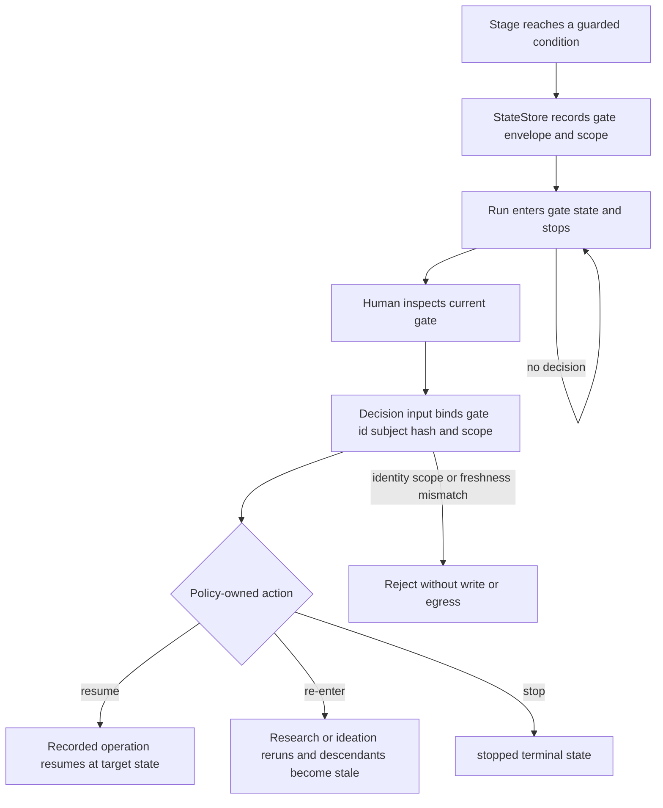
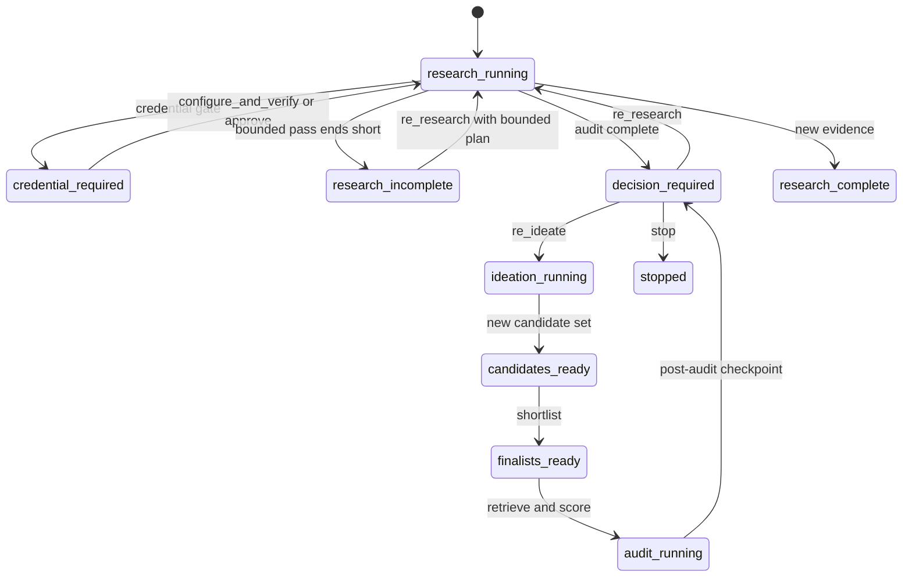

# Gates, Human Decisions, and Re-entry

A gate is a durable hard stop, not a suggestion to the agent. The state store records
what was suspended, the exact subject revision, an approval scope, the return state,
and the operation that may resume. The caller supplies an action and human identity;
it does **not** supply a target state or rewrite the scope. An unresolved gate never
auto-proceeds, times out into approval, or becomes valid merely because a later stage
is ready.

## Gate suspension and routing

*This flow shows suspension, validation, policy routing, and the fact that an unresolved gate never proceeds.*

`StateStore.suspend_gate` requires the requested return state to equal the run's exact
state before suspension and requires the gate state to be a legal transition. It then
persists the envelope, transition event, and new run state transactionally. A decision
must match the same `gate_id`, `subject_revision_hash`, and approval scope hash; the
subject must still be current and the run must still be at the recorded gate state.
The decision also carries `actor`, `reason`, and the original `suspended_operation`.
Changing `return_state`, adding `target_state`, changing the operation, or submitting
a decision for another run is rejected. The target comes from `gate_action_target`,
not from input.

Resolution artifacts are atomic for audit-related gates. They export an immutable JSON
artifact, persist the decision and event, activate the artifact, move the run, and
record idempotency in one transaction. Repeating an identical request replays its
persisted result; it does not authorize a different operation or revive stale inputs.
Ordinary authorization gates instead create a decision that the guarded operation
must consume. Only the designated authorizing actions can be consumed by a guarded
operation; `stop`, re-entry actions, and audit resolution branches cannot masquerade
as permission to continue an unrelated operation.

## Gate kinds, permitted actions, and target states

The following matrix is policy, not a menu of caller-selected transitions. `stop`
is available wherever listed and always targets `stopped`.

| Gate kind | Why it suspends | Actions | Policy-owned target |
|---|---|---|---|
| `conflict_resolution` | Profile facts conflict and cannot be merged safely | `choose_source`, `choose_value`, `retain_unresolved`, `stop` | The recorded profile return state for the first three; `stopped` for `stop` |
| `credential` | A live adapter needs credentials or an authentication failure requires consent | `configure_and_verify`, `approve`, `degrade`, `stop` | The recorded research/profile operation return state for `configure_and_verify` or `approve`; `degrade` follows the guarded degraded path; `stopped` for `stop` |
| `sensitive_disclosure` | A share or other boundary would expose sensitive fields | `approve`, `redact`, `stop` | `approve` returns to the recorded sharing state; `redact` targets `draft_ready` before review, otherwise `revision_required`; `stopped` for `stop` |
| `domain_pivot` | Ideation proposes a domain different from the bound profile/research domain | `approve`, `reject`, `stop` | `approve` returns to the recorded research/ideation state; `reject` follows the recorded pivot rejection path; `stopped` for `stop` |
| `coverage` | Audit coverage is too thin to support the bounded audit | `expand`, `retry`, `stop` | `research_running`, `audit_running`, or `stopped` respectively |
| `excessive_similarity` | One or more finalist audit results require an explicit risk disposition | `retain_with_warning`, `refine`, `replace`, `stop` | `audit_approved`, `ideation_running`, `research_running`, or `stopped` respectively |
| `post_audit_checkpoint` | Every completed audit requires a human dossier decision, even when all results are clean | `approve`, `re_ideate`, `re_research`, `stop` | `audit_approved`, `ideation_running`, `research_running`, or `stopped` respectively |

For conflict, credential, sensitive disclosure, and domain pivot, the ordinary
`decide_gate` path stores a decision that a matching operation later consumes. Coverage,
excessive similarity, and the post-audit checkpoint must use the versioned atomic
resolution input; a direct ordinary decision is refused. This prevents a partial audit
choice from advancing the run without its required artifact and bindings.

## Decision identity and scope checks

The decision input is schema-versioned: non-checkpoint gates require
`gate-decision-input-v1`; the post-audit checkpoint requires the exact
`gate-decision-input-v2` shape, including `feedback`. It must echo the envelope's
subject hash and complete approval scope exactly. Credential scopes bind the intended
operation and credential/request coordinates. Audit scopes bind the current audit,
finalist set, corpus set, feature maps, scorer configuration, and decision bindings.
Checkpoint feedback must contain exactly one `interesting` and `boring` entry for every
current finalist, while an approval with breaching finalists requires exactly one
`retain_with_warning` decision per affected finalist. The core derives the fixed warning;
a user-supplied `warning` field is invalid.

The checkpoint's `approve` is refused if any finalist remains
`coverage_insufficient`, because drafting requires an exact approved audit. A
`re_research` action requires a genuinely bounded plan; plans are forbidden for other
checkpoint actions. Scaffold placeholders are not authoring: core-side validation
rejects every surviving `TODO(agent)` marker, including one embedded inside prose.
Decision reasons and checkpoint dossier text are screened for prohibited legal
conclusions. None of these gates authorizes a conclusion about patentability, novelty,
validity, or FTO.

## Research and ideation re-entry

`post_audit_checkpoint` routes `re_ideate` to `ideation_running` and `re_research` to
`research_running`. The checkpoint feedback is the human direction for the next pass:
ideation must produce genuinely different candidates, while re-research must use the
bounded `plan.needed_research`. Re-authoring byte-identical candidates can replay stale
ideation rather than create new work.

A research re-entry is deliberately salted into a new attempt namespace. A spent
attempt coordinate is rejected, while replay of a completed attempt through its own
decision remains supported. Live second-pass research force-raises a fresh credential
gate even when a key is present; its scope binds the plan and literal second-pass terms
before egress. Offline research is the escape hatch when a stale anchor would otherwise
wedge the run.

The credential guard must suspend from the state it actually reaches. In particular,
when a fresh research pass first transitions from `research_incomplete` or
`insufficient_evidence` to `research_running`, the credential gate returns to
`research_running`, not the caller's earlier state. If a gate cannot be legally raised,
the runner refuses before any egress. This invariant is exercised in both the
single-query and batch runners and on fresh-key and replayed `research.start` paths.

Publishing replacement research does not mutate old artifacts in place. Immutable
artifact dependencies mark candidate, finalist, corpus, feature-map, audit, and
related downstream revisions stale; the old gate resolution likewise cannot be used.
The safe route is to rebuild ideation, shortlist, audit retrieval, scoring, and the
post-audit checkpoint from current hashes. A durable decision export at
`<run>/decision-exports/ar_<revision_id>.json` remains readable after database staleness
updates, so a fresh session can recover the human feedback even after the first new
publish invalidates the resolution artifact.

*This lifecycle shows credential recovery and the two human-controlled post-audit re-entry routes.*

## Audit decisions and disclosure decisions

Coverage `expand` returns to research with a bounded expansion plan; `retry` returns
to audit; `stop` is terminal. Excessive similarity is resolved per affected finalist.
All affected finalist IDs must appear exactly once, and the top-level action must match
the policy-derived aggregate: any `replace` dominates, then `refine`, otherwise
`retain_with_warning`. Retention persists the core-derived warning and reaches
`audit_approved`; refine returns to ideation; replace returns to research. The checkpoint
is distinct: it covers every finalist, not only breaches, and its clean `approve` still
stops at the human decision before drafting.

Sharing is a separate boundary after local completion. The share operation requires a
current report plus matching review, validation, recipient, purpose, destination, and
sensitive-field scope. The first attempt raises `sensitive_disclosure`; only a matching
`approve` can publish. `redact` creates a new report revision and routes to
`revision_required` when the report has already been reviewed, validated, or completed
(and to `draft_ready` earlier), so the report must pass downstream checks again.
`stop` prevents release. The resulting share receipt binds report, review, validation,
destination, recipient, purpose, and approval scope.

## Operational and testing guidance

Use `run status` to find the current gate and `gate inspect` to read its immutable
scope; use `run show` for current artifacts. Scaffold the matching input, fill every
human field, and submit through `gate decide`. Never edit SQLite or decision exports,
fabricate IDs, or pass a caller-chosen state. Keep exports inside the configured private
run directory; decision input is also checked for credential canaries.

Focused verification includes `tests/integration/test_g002_gate_matrix.py` for legal
return-state/operation binding, atomic audit resolution, and terminal stops;
`tests/integration/test_g006_decisions.py` for complete finalist coverage, aggregate
branch policy, stale binding rejection, bounded plans, rollback, replay, and private
exports; `tests/integration/test_g010_checkpoint.py` for checkpoint schema and human
feedback rules; and `tests/integration/test_research_reentry_gate.py` plus
`tests/integration/test_research_reentry_guard.py` for salted second passes,
credential-gate reachability, suspendability, pre-egress refusal, and stale-anchor
escape behavior.
